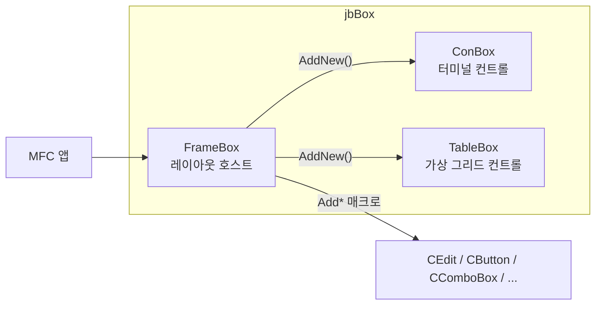
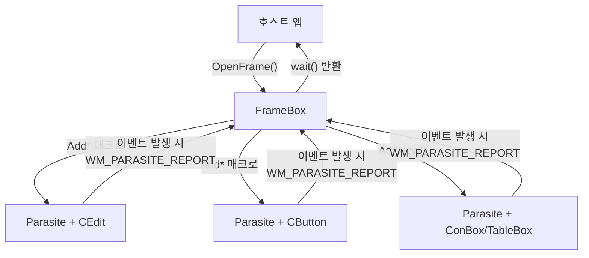
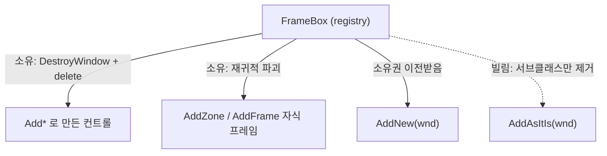
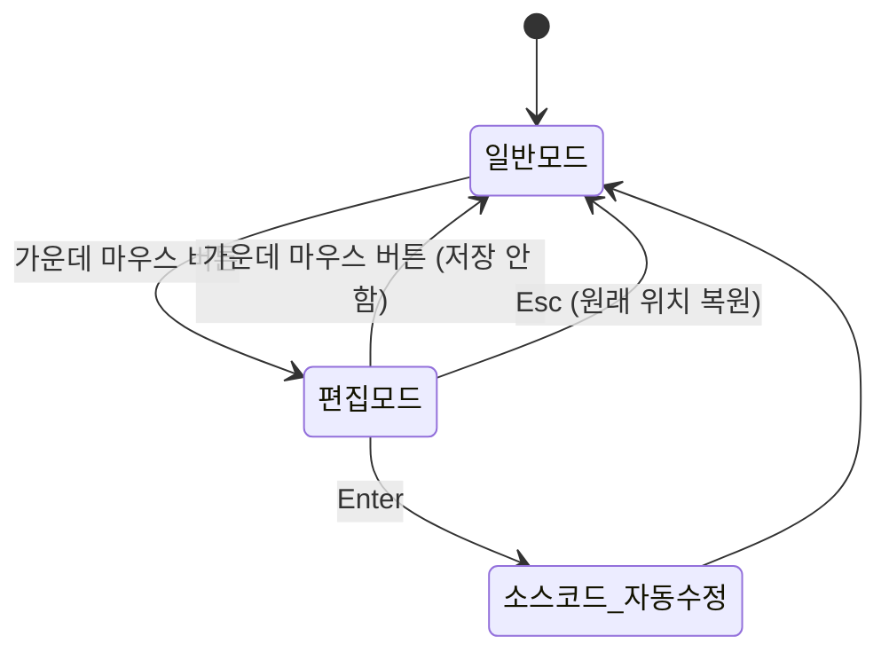
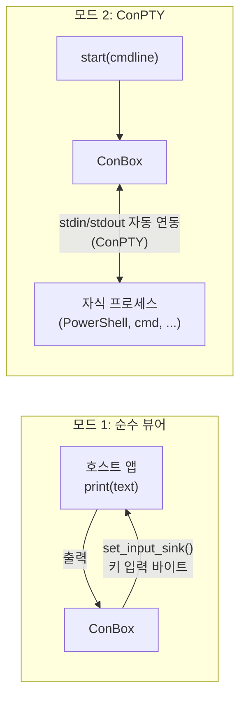
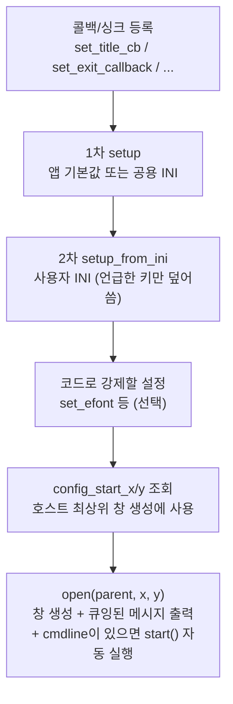
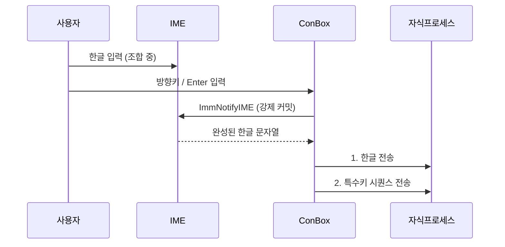
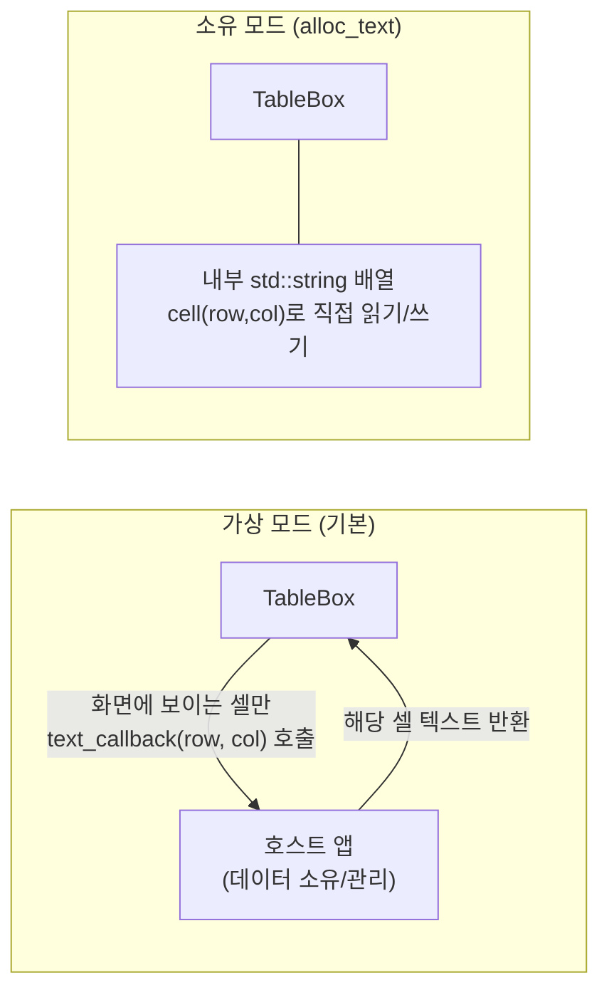
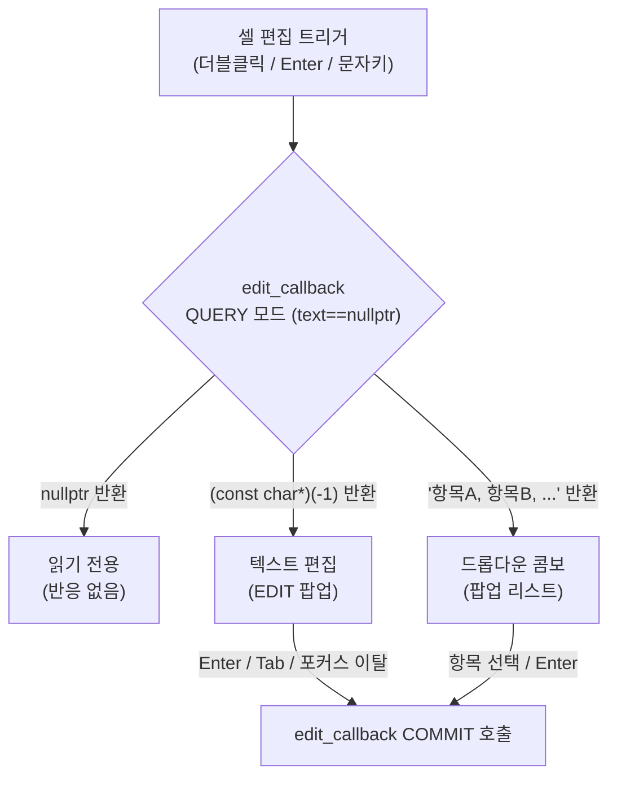
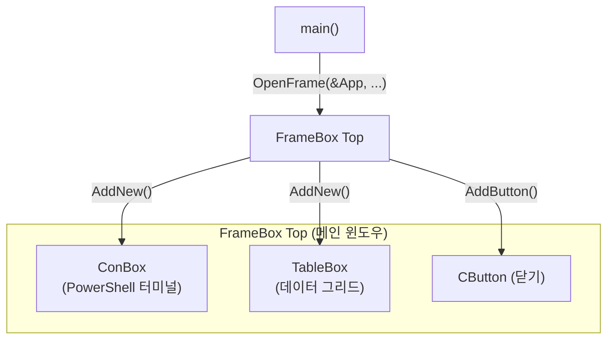

# jbBox 클래스 라이브러리 개발자 매뉴얼

이 문서는 jbBox 소스코드를 받아 자신의 MFC 프로그램에 통합하려는 **개발자**를 대상으로 합니다. 각 모듈의 공개 API, 호출 순서, 소유권 규칙, 그리고 실수하기 쉬운 지점을 설명합니다.

## 목차

1. [라이브러리 개요와 통합 방법](#1-라이브러리-개요와-통합-방법)
2. [FrameBox - 레이아웃 호스트](#2-framebox---레이아웃-호스트)
3. [ConBox - 터미널 컨트롤](#3-conbox---터미널-컨트롤)
4. [TableBox - 가상 그리드 컨트롤](#4-tablebox---가상-그리드-컨트롤)
5. [통합 사용 예시](#5-통합-사용-예시)
6. [부록 A - ConBox INI 전체 레퍼런스](#부록-a---conbox-ini-전체-레퍼런스)
7. [부록 B - 모듈 간 메시지 프로토콜](#부록-b---모듈-간-메시지-프로토콜)
8. [부록 C - 자주 저지르는 실수](#부록-c---자주-저지르는-실수)

---

## 이 문서의 [캡처] 표시에 대하여

본문 곳곳에 아래와 같은 인용 줄이 있습니다.

> **[캡처]** 편집 모드 진입 후 컨트롤 테두리에 리사이즈 커서가 표시된 화면

이것은 **그림이 들어갈 자리를 표시한 자리표시자**이며, 뒤에 적힌 문장은 그 자리에 무엇을 찍어 넣어야 하는지에 대한 지시입니다. 마크다운 판에서는 이 줄을 그대로 두고, Word·한글(HWP)·PDF 등 배포용 문서를 만들 때 **해당 줄 전체를 실제 화면 캡처 이미지로 교체**하십시오.

캡처를 찍을 때 권장하는 조건입니다.

- **줌 100%, 96 DPI 기준**으로 찍습니다. 이 문서의 모든 좌표·크기 설명이 96 DPI 논리 픽셀 기준이므로, 다른 배율에서 찍으면 본문 수치와 화면이 어긋나 보입니다. 단, 줌·DPI 동작 자체를 보여주는 캡처(예: 150% 줌 화면)는 예외입니다.
- **설명 대상이 화면에서 차지하는 비중이 크도록** 창만 잘라내고, 관계없는 바탕화면·다른 창은 포함하지 않습니다.
- **차이를 보여주는 캡처**(예: `builtin_glyphs` 0과 2의 비교)는 두 화면을 나란히 배치하고 어느 쪽이 어떤 설정인지 표시합니다.
- 캡처 안의 글자가 본문 글자보다 작아지지 않도록, 필요하면 해당 부분만 확대해서 찍습니다.

---

## 1. 라이브러리 개요와 통합 방법

jbBox는 MFC(Microsoft Foundation Classes) 기반 C++ 클래스 라이브러리로, 서로 독립적인 세 모듈로 구성됩니다.



| 모듈 | 역할 | 포팅 단위 | 다른 모듈 의존 |
|---|---|---|---|
| FrameBox | 컨트롤 레이아웃 호스트 + 런타임 편집기 | `FrameBox.h` + `FrameBox.cpp` | 없음 |
| ConBox | VT100/VT220 호환 터미널 컨트롤 (ConPTY 지원) | `ConBox.h` + `ConBox.cpp` | 없음 |
| TableBox | 엑셀형 가상 그리드 컨트롤 | `TableBox.h` + `TableBox.cpp` | 없음 |

세 모듈은 **서로를 include하지 않습니다.** ConBox만, 또는 TableBox만 필요하다면 해당 `.h`/`.cpp` 두 파일만 프로젝트에 복사하면 그대로 동작합니다. FrameBox와의 연동(줌 전파, 종료 협상)은 헤더가 아니라 **숫자값이 같은 윈도우 메시지**(`WM_JBZOOM`, `WM_JBCLOSEQUERY`)로만 이루어지므로, 모듈 간 컴파일 의존성이 생기지 않습니다(부록 B 참조).

### 1.1 공통 요구사항

- **OS**: Windows 10 1809(빌드 17763) 이상. 이 제약은 ConBox의 ConPTY 실행(`start()`)에만 적용되며, 나머지 기능과 다른 모듈은 더 낮은 버전에서도 동작합니다.
- **컴파일러**: Visual Studio 2022. **Unicode / MBCS 두 문자 집합 설정 모두 지원**합니다. 이를 위해 모든 Win32/MFC 호출은 명시적 W-접미사 형태(`::CreateFontIndirectW`, `::TextOutW`, `::GetObjectW` 등)를 사용합니다. 라이브러리를 수정할 때도 이 규칙을 지켜야 MBCS 빌드가 깨지지 않습니다.
- **DPI 인식**: 호스트 앱의 매니페스트에서 **PerMonitorV2** DPI 인식을 활성화해야 합니다. 세 모듈 모두 모니터별 DPI 변경에 반응하여 폰트와 셀 크기를 다시 계산합니다. 이 설정이 없으면 고DPI 모니터에서 흐릿하게 확대된 화면이 됩니다.
- **좌표 단위**: 모든 공개 API의 좌표/크기는 **96 DPI 논리 픽셀** 기준입니다. 런타임에 실제 모니터 DPI와 줌 배율로 자동 변환되므로, 소스코드에 적는 숫자는 DPI와 무관하게 항상 같습니다.
- **문자열**: 모든 문자열 API는 **UTF-8 (`const char*`)** 을 받고 돌려줍니다. C++ 문자열 리터럴을 그대로 넘길 수 있습니다. `CString`, `wchar_t*`, `TCHAR`는 공개 인터페이스에 등장하지 않습니다.
- **링크**: ConBox는 한글 IME 처리에 필요한 `imm32.lib`를 `#pragma comment`로 자동 링크합니다. 호스트가 별도로 설정할 필요가 없습니다. GDI+(FrameBox 배경 이미지)와 `dwmapi.lib`(제목 표시줄 색상, 호스트 측 코드)는 사용하는 쪽에서 링크합니다.

### 1.2 프로젝트에 넣는 방법

1. 필요한 모듈의 `.h`/`.cpp`를 프로젝트에 추가합니다. 소스 파일은 **UTF-8 with BOM**으로 저장되어 있습니다.
2. 미리 컴파일된 헤더(PCH)를 쓰지 않아도 됩니다. 세 `.cpp` 모두 필요한 헤더를 스스로 include하는 자기완결 구조입니다. PCH를 쓰는 프로젝트라면 이 세 파일만 "미리 컴파일된 헤더 사용 안 함"으로 설정하는 편이 간단합니다.
3. `.cpp`에서 include할 때는 **`FrameBox.h`를 가장 먼저** 두십시오. 이 헤더가 `<afxwin.h>`보다 먼저 `_WIN32_WINNT`를 정의하므로, 순서가 뒤바뀌면 `_WIN32_WINNT not defined` 경고나 ConPTY 선언 누락이 발생합니다.

```cpp
#include "FrameBox.h"    // 항상 먼저
#include "ConBox.h"
#include "TableBox.h"
```

### 1.3 애플리케이션 진입 구조

jbBox는 MFC의 문서/뷰 구조를 쓰지 않고, `CWinApp::InitInstance()`에서 일반 `main()` 함수를 호출하는 절차지향 스타일을 전제로 설계되었습니다. `FrameBox`는 `CFrameWnd`가 아닌 **순수 `CWnd` 파생**이라, 창이 파괴되어도 `WM_QUIT`가 자동으로 posting되지 않습니다. 따라서 메시지 루프를 직접 돌리는 아래 구조가 가능합니다.

```cpp
class cMyApp : public CWinApp {
    int exit_code = 0;
public:
    BOOL InitInstance() override {
        int main(int argc, const char* argv[]);

        INITCOMMONCONTROLSEX icc = { sizeof(icc), ICC_WIN95_CLASSES };
        InitCommonControlsEx(&icc);          // 커먼 컨트롤(TabCtrl, Slider 등) 사용 시 필수
        CWinApp::InitInstance();

        exit_code = main(__argc, const_cast<const char**>(__argv));
        return FALSE;                        // FALSE: MFC의 기본 메시지 루프를 돌리지 않고 즉시 종료
    }
    int ExitInstance() override { return exit_code; }
};

cMyApp   App;      // 전역 인스턴스
FrameBox Top;      // 전역 또는 main() 지역 변수 모두 가능

int main(int argc, const char* argv[]) {
    Top.OpenFrame(&App, 100, 100, 900, 600);
    // ... 컨트롤 배치 ...
    Top.listen(button1, button2);
    while (::IsWindow(Top)) {
        CWnd* ev = Top.wait();
        if (!ev || ev == button1) break;
    }
    return 0;
}
```

> **명령줄 인수 주의**: `__argv`(narrow)는 UTF-8이 아니라 프로세스의 ANSI 코드페이지(한국어 Windows에서는 CP949)로 인코딩되어 있습니다. jbBox의 모든 API는 UTF-8을 기대하므로, 한글이 포함될 수 있는 인수는 반드시 **`__wargv`**(wide)를 읽어 `WideCharToMultiByte(CP_UTF8, ...)`로 변환해서 넘기십시오. `__wargv`는 `WinMain`으로 진입하는 MFC 앱에서도 CRT 시작 코드가 자동으로 채워줍니다.

---

## 2. FrameBox - 레이아웃 호스트

### 2.1 개요

FrameBox는 MFC 컨트롤들을 동적으로 배치·소유·관리하는 호스트 윈도우입니다. 세 가지 핵심 기능을 제공합니다.

1. **절차지향 이벤트 처리**: `while` 루프 안에서 `wait()`를 호출하여, 어떤 컨트롤에서 이벤트가 발생했는지 순차적으로 처리합니다. 콜백이나 메시지 맵을 작성할 필요가 없습니다.
2. **런타임 레이아웃 편집**: 실행 중에 컨트롤 위치/크기를 마우스로 조정하고 확인하면, **소스코드의 좌표 리터럴이 직접 수정**됩니다 (Debug 빌드 전용).
3. **소유권 자동 관리**: `Add*`로 만든 컨트롤은 FrameBox가 소유하며, 소멸자가 역순으로 정리합니다.

### 2.2 구조

FrameBox가 컨트롤을 생성하면 각 컨트롤에 **Parasite**가 자동으로 부착됩니다. Parasite는 컨트롤을 서브클래싱하여 편집 기능과 이벤트 중계를 담당합니다.



### 2.3 기본 사용법

```cpp
#include "FrameBox.h"

void DemoMain() {
    // 1. FrameBox 생성. 인수는 (좌, 상, 우, 하) 화면 좌표 -- 폭/높이가 아닙니다.
    FrameBox Top;
    Top.OpenFrame(&theApp, 560, 275, 1360, 875);   // 96 DPI 논리 픽셀

    // 2. 컨트롤 추가 (x0, y0, x1, y1 순서 = 좌, 상, 우, 하)
    CEdit*     e = Top.AddEdit  (10, 10, 200, 45);
    CButton*   b = Top.AddButton(10, 55, 110, 90, "확인");
    CComboBox* c = Top.AddCombo (10, 100, 210, 160, "항목A,항목B,항목C");

    // 3. 감시 대상 등록 (루프 진입 전에 한 번만)
    Top.listen(e, b, c);

    // 4. 이벤트 루프
    while (::IsWindow(Top)) {
        CWnd* ev = Top.wait();       // 블록. 이벤트가 발생한 컨트롤을 반환
        if (ev == 0) break;          // 창이 닫힘
        if (ev == b)  break;          // 확인 버튼
        if (ev == e)  { /* 편집 완료 */ }
    }
    // 스코프 종료 시 ~FrameBox()가 모든 컨트롤을 역순으로 자동 해제
}
```

> **[캡처]** 위 코드로 생성된 기본 FrameBox 창 (Edit, Button, ComboBox 배치)

**`listen()`과 `wait()`는 별개의 함수입니다.** 이 둘을 혼동하는 것이 가장 흔한 실수입니다.

| 호출 | 반환 | 동작 |
|---|---|---|
| `listen(a, b, c, ...)` | `void` | 인수로 준 컨트롤들을 감시 집합에 **추가**합니다 (기존 집합을 지우지 않음). 블록하지 않습니다. |
| `listen()` (인수 없음) | `void` | 감시 집합을 **전부 해제**합니다. `close()`가 내부적으로 호출합니다. |
| `wait()` | `CWnd*` | 감시 중인 컨트롤 하나가 신호를 보낼 때까지 **블록**합니다. 감시 집합은 그대로 유지되므로 루프에서 반복 호출할 수 있습니다. |

`wait()`의 반환값은 세 가지로 해석합니다.

- **`nullptr`** : 창이 닫혔습니다. 루프를 빠져나가야 합니다.
- **`this`(= `&Top`)** : `timer()`로 설정한 타이머가 만료되었습니다.
- **그 외** : 그 컨트롤에서 이벤트가 발생했습니다. `if (ev == button)`처럼 포인터 비교로 판별합니다.

`wait()`는 진입 시 `show()`를 자동으로 호출합니다. `open()`이 창을 **숨긴 상태로** 만들기 때문에, 첫 `wait()` 호출 시점에 비로소 창이 화면에 나타납니다. UI 구성을 모두 마친 뒤 보여주므로 조립 과정이 사용자에게 노출되지 않습니다. 루프를 돌기 전에 창을 먼저 보여야 한다면 `show()`를 명시적으로 호출하십시오.

### 2.4 OpenFrame - 창 생성

```cpp
bool open(CWinApp* app,   int x0, int y0, int x1, int y1, const char* file, int line);
bool open(CWnd*    owner, int x0, int y0, int x1, int y1, const char* file, int line);
#define OpenFrame(p,x0,y0,x1,y1)  open((p), (x0),(y0),(x1),(y1), LAYOUT_SRC)
```

항상 매크로 형태인 `OpenFrame(...)`을 쓰십시오. `__FILE__`/`__LINE__`을 자동으로 주입하여 레이아웃 편집기가 이 호출부를 찾아 수정할 수 있게 합니다.

**첫 인수의 타입이 창의 종류를 결정합니다.**

| 첫 인수 | 만들어지는 창 | 부가 동작 |
|---|---|---|
| `CWinApp*` | 최상위 메인 윈도우 (`WS_OVERLAPPEDWINDOW`) | `app->m_pMainWnd = this`로 바인딩 |
| `CWnd*` | 소유된 팝업 (`WS_POPUP\|WS_CAPTION\|WS_SYSMENU`) | **모달**: 소유자를 `EnableWindow(FALSE)`로 비활성화하고, `close()`에서 다시 활성화 |

> 첫 인수로 `0`이나 `nullptr`을 그냥 넘기면 **오버로드가 모호해져 컴파일 에러**가 납니다. 반드시 구체적 타입의 포인터를 넘기십시오.

**좌표 해석 규칙**은 두 가지입니다.

- 일반적인 경우: `(x0, y0, x1, y1)`은 **좌·상·우·하 절대 좌표**입니다. 폭은 `x1 - x0`이 됩니다.
- `x0 == CW_USEDEFAULT`이고 소유자가 없는(`CWinApp*` 형태) 경우에만: 시스템이 창 위치를 정하고, `x1`/`y1`이 **폭과 높이**로 해석됩니다. 창이 놓일 위치가 생성 전에는 알 수 없으므로 우/하단 좌표를 지정할 방법이 없기 때문입니다.

```cpp
Top.OpenFrame(&App, 100, 100, 900, 600);                  // (100,100)~(900,600), 즉 800x500 크기
Top.OpenFrame(&App, CW_USEDEFAULT, CW_USEDEFAULT, 900, 600);  // 시스템이 위치 결정, 900x600 크기
```

`open()`은 **멱등**합니다. 두 번째 호출은 창을 다시 만들지 않고 위치만 옮깁니다.

### 2.5 컨트롤 추가 매크로

모든 매크로는 `(x0, y0, x1, y1, [추가인수])` 형태이며, **좌표가 반드시 앞의 네 개**입니다(소스 재작성기가 이 규칙에 의존합니다). 반환값은 해당 MFC 클래스 포인터이며, 그 객체는 FrameBox가 소유합니다.

| 매크로 | 반환 타입 | 추가 인수 |
|---|---|---|
| `AddStatic(x0,y0,x1,y1, text)` | `CStatic*` | 레이블 텍스트 (UTF-8) |
| `AddButton(x0,y0,x1,y1, text)` | `CButton*` | 버튼 텍스트 |
| `AddEdit(x0,y0,x1,y1, text)` | `CEdit*` | 초기 텍스트 |
| `AddCombo(x0,y0,x1,y1, items)` | `CComboBox*` | 쉼표 구분 항목 목록. 각 항목은 trim되고 `SetCurSel(0)`이 적용됨 |
| `AddList(x0,y0,x1,y1, text)` | `CListBox*` | |
| `AddRichEdit(x0,y0,x1,y1, text)` | `CRichEditCtrl*` | |
| `AddListCtrl(x0,y0,x1,y1, text)` | `CListCtrl*` | |
| `AddTreeCtrl(x0,y0,x1,y1, text)` | `CTreeCtrl*` | |
| `AddTabCtrl(x0,y0,x1,y1, text)` | `CTabCtrl*` | |
| `AddDateTime(x0,y0,x1,y1, text)` | `CDateTimeCtrl*` | |
| `AddMonthCal(x0,y0,x1,y1, text)` | `CMonthCalCtrl*` | |
| `AddSpin(x0,y0,x1,y1, text)` | `CSpinButtonCtrl*` | |
| `AddSlider(x0,y0,x1,y1, text)` | `CSliderCtrl*` | |
| `AddScrollBar(x0,y0,x1,y1, text)` | `CScrollBar*` | |
| `AddIPAddress(x0,y0,x1,y1, text)` | `CIPAddressCtrl*` | |
| `AddHotKey(x0,y0,x1,y1, text)` | `CHotKeyCtrl*` | |
| `AddProgress(x0,y0,x1,y1, text)` | `CProgressCtrl*` | |
| `AddStatus(x0,y0,x1,y1, text)` | `CStatusBarCtrl*` | |
| `AddHeader(x0,y0,x1,y1, text)` | `CHeaderCtrl*` | |
| `AddZone(x0,y0,x1,y1)` | `FrameBox*` | 자식 FrameBox (`WS_CHILD`, 프레임 내부 영역) |
| `AddFrame(x0,y0,x1,y1)` | `FrameBox*` | 자식 FrameBox (`WS_POPUP`, 별도 창) |
| `AddNew(x0,y0,x1,y1, wnd)` | `CWnd*` | 이미 생성된 `CWnd*`. **소유권 이전** (레지스트리가 `DestroyWindow` + `delete`) |
| `AddAsItIs(x0,y0,x1,y1, wnd)` | `CWnd*` | 이미 생성된 `CWnd*`. **소유권 유지** (서브클래스만 제거) |

`AddCombo` 이외의 컨트롤에서 추가 인수는 `SetWindowTextW`로 적용됩니다. 생략하면 아무것도 하지 않습니다.

**`AddNew(0,0,0,0, wnd)`의 특별한 의미**: 좌표를 모두 0으로 주면 **attach-only** 모드가 되어, 이미 만들어진 창을 이동/리사이즈하지 않고 현재 위치·크기 그대로 등록합니다. ConBox처럼 자기 자신이 INI 설정을 근거로 크기를 계산하는 자식을 붙일 때 사용합니다.

```cpp
ConBox* con = new ConBox;
con->setup_from_ini("my.ini");
con->open(&Top, 0, 0);           // ConBox가 폰트/그리드로부터 스스로 크기 결정
Top.AddNew(0, 0, 0, 0, con);     // 그 크기를 존중하며 등록
Top.fit_to_children();           // FrameBox를 ConBox 크기에 맞춤
```

> 모든 좌표는 **96 DPI 논리 픽셀** 기준이며, 런타임에 실제 모니터 DPI와 줌 배율로 자동 스케일됩니다.

> **[캡처]** 여러 종류의 Add* 컨트롤(Static, Button, Edit, Combo, List, Slider, Progress, DateTime 등)을 한 프레임에 배치한 샘플 화면 -- 각 매크로가 어떤 컨트롤을 만드는지 한눈에 보이도록

### 2.6 소유권과 수명



- `~FrameBox()`는 등록 역순으로 `Parasite 삭제 → DestroyWindow → delete wnd` 순서로 정리합니다.
- `AddNew`에 넘기는 포인터는 반드시 **힙에서 `new`로 만든 것**이어야 합니다. 스택 객체를 넘기면 `delete`에서 크래시합니다.
- `AddAsItIs`는 창을 파괴하지도 `delete`하지도 않습니다. 수명을 호스트가 직접 관리해야 합니다.
- 루트 FrameBox 자신은 레지스트리에 속하지 않으므로, 만든 쪽이 책임집니다. 전역/스택 객체로 두거나(가장 흔한 형태), `new`로 만들었다면 직접 `delete`해야 합니다.
- `PostNcDestroy()`는 아무 일도 하지 않도록 재정의되어 있습니다. MFC의 관례와 달리 **자기 자신을 `delete`하지 않습니다.**

### 2.7 런타임 레이아웃 편집 (Debug 빌드 전용)

Parasite가 각 컨트롤에 부착되어 편집 기능을 제공합니다. **확인 시 `Add*`/`OpenFrame` 호출부의 좌표 리터럴이 소스코드에서 직접 수정**됩니다.



**편집 모드 조작법**

| 조작 | 동작 |
|---|---|
| 가운데 마우스 버튼 | 편집 모드 토글 |
| 드래그 (컨트롤 안쪽) | 이동 |
| 드래그 (테두리 근처) | 크기 조절 (커서 모양이 8방향 리사이즈로 바뀜) |
| 화살표 키 | **5px 격자에 맞춰** 이동 (현재 좌표에서 다음 5의 배수로 스냅) |
| Ctrl + 화살표 키 | 1px 이동 |
| Shift + 화살표 키 | 5px 격자에 맞춰 크기 조절 (우/하단 변만 이동) |
| Ctrl + Shift + 화살표 키 | 1px 크기 조절 |
| Enter | 확인 → 소스코드 자동 수정 |
| Esc | 취소 (원래 위치 복원) |

편집 모드에 들어간 컨트롤은 마우스 입력이 차단되어 원래 기능(버튼 클릭 등)이 동작하지 않습니다. 다른 컨트롤에 진입하거나 다시 가운데 버튼을 눌러 빠져나옵니다.

**소스 재작성기의 제약** (`LayOutRewrite`)

- 좌표는 **정수 리터럴**이어야 합니다. `AddButton(x, y, x+100, y+30, ...)`처럼 식을 쓰면 재작성에 실패합니다.
- 호출문이 **한 줄 안에** 있어야 합니다.
- 소스 파일이 ANSI 또는 BOM 없는 UTF-8이어야 합니다. **UTF-8 with BOM이나 UTF-16 파일은 거부**됩니다. 이 프로젝트의 소스 규약(UTF-8 with BOM)과 충돌하므로, 편집 기능을 실제로 쓰려면 해당 파일만 BOM 없이 저장해야 합니다.
- 저장되는 값은 항상 **96 DPI 논리 좌표**이므로, 어떤 DPI/줌 상태에서 편집하든 소스에는 같은 기준의 숫자가 기록됩니다.
- Release 빌드에서는 편집 기능 전체가 컴파일에서 제외되고, 매크로가 `nullptr, 0`을 넘기므로 **소스 경로 문자열이 바이너리에 남지 않습니다.**

> **[캡처]** 편집 모드 진입 후 컨트롤 테두리에 리사이즈 커서가 표시된 화면

> **[캡처]** 컨트롤을 드래그하여 이동/크기 조절하는 중인 화면 (편집 중인 컨트롤의 테두리 강조 표시가 보이도록)

> **[캡처]** Enter 확인 후 소스코드의 좌표 리터럴이 자동 수정된 결과 -- 수정 전후의 같은 소스 줄을 나란히 배치 (에디터 화면)

### 2.8 키보드 처리 계약 (중요)

`FrameBox::PreTranslateMessage`는 대화상자와 유사한 기본 키 처리를 수행합니다. 이 동작을 모르면 예기치 않게 창이 닫힙니다.

| 키 | 기본 동작 |
|---|---|
| **Esc** | **창을 닫습니다** (`PostMessage(WM_CLOSE)`) |
| Enter | 포커스가 푸시버튼이면 `BM_CLICK`을 보냅니다. 그 외에는 소비되어 `WM_CHAR '\r'`이 생성되지 않습니다. 단, `ES_MULTILINE | ES_WANTRETURN` 에디트 컨트롤은 예외로 Enter를 직접 처리합니다. |
| Ctrl + 마우스 휠 | 프레임 전체 줌 (2.9 참조) |

**포커스를 가진 자식이 `WM_GETDLGCODE`에 `DLGC_WANTALLKEYS`를 반환하면, Esc/Enter를 가로채지 않고 그대로 전달합니다.** ConBox와 TableBox가 이 값을 반환하므로, 터미널에서 Esc를 눌러도 창이 닫히지 않고 자식 프로세스로 전달됩니다.

직접 만든 `CWnd` 파생 컨트롤에서 Esc/Enter를 받아야 한다면 같은 방식으로 `OnGetDlgCode()`에서 `DLGC_WANTALLKEYS`를 반환하십시오. 또는 서브클래스에서 `PreTranslateMessage`를 재정의해 해당 키를 먼저 소비하는 방법도 있습니다.

```cpp
class cMyFrame : public FrameBox {
    BOOL PreTranslateMessage(MSG* pMsg) override {
        // Esc로 창이 닫히는 것을 막고 싶을 때
        if (pMsg->message == WM_KEYDOWN && pMsg->wParam == VK_ESCAPE)
            return TRUE;                       // 소비
        return FrameBox::PreTranslateMessage(pMsg);
    }
};
```

편집 모드가 활성화된 상태에서는 방향키/Enter/Esc가 Parasite에게 먼저 전달됩니다. 직접 `PreTranslateMessage`를 재정의할 때 `Parasite::editing_hwnd()`가 `pMsg->hwnd`와 같으면 `FALSE`를 반환하여 Parasite에게 양보하십시오.

### 2.9 Ctrl + 휠 줌

`Ctrl + 마우스 휠`로 프레임과 모든 자식을 함께 확대/축소합니다.

- **줌 범위**: `eff_dpi()` 기준(= 실제 모니터 DPI와 줌을 합쳐 화면에 실제 적용되는 값) 25% ~ 500%. 휠 한 칸당 5%p 단위로 바뀌며, 현재 값이 5%의 배수가 아니어도 휠 방향으로 다음 5% 배수까지 스냅합니다(`zoom_pm` 자체의 수치 범위는 모니터 DPI에 따라 달라지지만, 화면에 적용되는 `eff_dpi()` 기준 퍼센트는 항상 25%~500%로 고정됩니다).
- **커서 앵커**: 커서가 프레임 안에 있으면 커서 아래 픽셀이 화면에 고정되고, 밖에 있으면 좌상단이 고정됩니다.
- **자식 전파**: 레지스트리의 모든 자식에게 `WM_JBZOOM`(wParam = zoom_pm)이 전송된 **뒤에** 실제 리사이즈가 일어납니다. ConBox/TableBox는 이 메시지에서 내부 배율을 갱신하므로, 이어지는 `WM_SIZE`에서 올바른 폰트 크기로 다시 그립니다.

서브클래스에서 줌에 반응하려면 `apply_zoom`을 재정의합니다. Ctrl+휠은 메시지가 아니라 직접 호출이므로 `WindowProc`로는 가로챌 수 없기 때문에, 이 함수가 `virtual protected`로 열려 있습니다.

```cpp
class cMyFrame : public FrameBox {
protected:
    void apply_zoom(int new_pm, bool cursor_anchor) override {
        FrameBox::apply_zoom(new_pm, cursor_anchor);   // 반드시 먼저 호출
        update_title();                                 // 예: 제목 표시줄에 배율 표시
    }
    void update_title() {
        wchar_t buf[64];
        swprintf_s(buf, L"MyApp  %d%%  (%d DPI)", ::MulDiv(eff_dpi(), 100, 96), eff_dpi());
        SetWindowTextW(buf);
    }
};
```

`dpi`(실제 모니터 DPI), `zoom_pm`(줌 x1000), `eff_dpi()`(= `dpi * zoom_pm / 1000`)는 모두 `protected`이므로 서브클래스에서 읽을 수 있습니다.

> **[캡처]** 150% 줌 상태에서 FrameBox와 자식 컨트롤들이 확대된 화면

### 2.10 모달 서브 다이얼로그

첫 인수로 `CWnd*`를 넘기면 소유자를 자동으로 비활성화하는 모달 팝업이 생성됩니다. 소멸자(또는 `close()`)가 소유자를 다시 활성화합니다.

```cpp
void DemoSub(CWnd* owner) {
    FrameBox Sub;
    Sub.OpenFrame(owner, 200, 200, 600, 500);   // owner 자동 Disable
    Sub.set_margin(5);
    CStatic* msg = Sub.AddStatic(22, 124, 262, 148, "모달 서브 프레임");
    CButton* ok  = Sub.AddButton(155, 9, 275, 41, "OK");
    AlignText(msg, 5);

    Sub.listen(ok);
    while (::IsWindow(Sub)) {
        CWnd* ev = Sub.wait();
        if (!ev || ev == ok) break;
    }
}   // 스코프 종료 → ~FrameBox() → close() → owner 재활성화
```

부모의 `wait()` 루프 안에서 이 함수를 호출하면 됩니다. 서브 다이얼로그가 자체 `wait()` 루프를 돌리는 동안 부모 루프는 그 안에서 멈춰 있습니다.

> **[캡처]** 모달 서브 다이얼로그가 열린 화면 -- 뒤쪽 부모 프레임이 비활성화되어 클릭에 반응하지 않는 상태가 드러나도록 두 창을 함께

### 2.11 창 꾸미기 API

```cpp
void set_margin(int margin_96);        // 자식들을 감싸도록 자동 크기 조절 (기본 -1 = 비활성)
void fit_to_children();                // 지금 즉시 자식 크기에 맞춰 리사이즈
bool set_image(int resource_id);       // 배경 이미지 (RCDATA: JPEG/PNG/BMP)
bool set_image(const char* file);      // 배경 이미지 (UTF-8 경로)
void set_bg_color(COLORREF color);     // 단색 배경 (이미지를 대체)
void set_bg_color();                   // 기본 대화상자 색(COLOR_BTNFACE)으로 복원
int  frameless(int option);            // 타이틀바 제거 + 자체 캡션 버튼
int  timer(int period_ms);             // 반복 타이머 (wait()가 this를 반환)
int  add_menu(const char* label, { {"항목", 콜백}, ... });   // 런타임 메뉴바
void modify_menu_label(int id, const char* label);
```

**`set_margin` / `fit_to_children`**: `set_margin(n)`을 호출해 두면, 줌이나 DPI 변경으로 자식들이 재배치될 때마다 프레임이 "가장 오른쪽/아래쪽 자식 끝 + n px"로 자동 리사이즈됩니다. `fit_to_children()`은 같은 계산을 지금 즉시 한 번 수행합니다. 시작 시점에 자식(ConBox 등)이 스스로 계산한 크기에 프레임을 맞출 때 직접 호출합니다.

**`set_image`**: GDI+로 로드하며, 클라이언트 영역에 늘려 그립니다. 리샘플 결과는 캐시되므로 줌 중에도 느려지지 않습니다. 파일에서 읽을 때는 바이트를 복사하므로 반환 후 파일이 잠기지 않습니다. **실패하면 배경이 빨간 단색으로 바뀌고 `false`를 반환**하여 오류를 눈에 띄게 합니다.

**`frameless(option)`**: OS 타이틀바를 제거하고 클라이언트 우상단에 Ubuntu 스타일 원형 캡션 버튼을 직접 그립니다. 반드시 `open()` **이후에** 호출해야 합니다.

| option | 결과 |
|---|---|
| 0 | 프레임 없음, 버튼도 없음 |
| 1 | 닫기만 |
| 2 | 닫기 + 최소화 |
| 3 | 닫기 + 최소화 + 최대화 |
| 그 외 | 아무 일도 하지 않고 `-1` 반환 |

반환값은 성공 시 `0`, 잘못된 option이면 `-1`, 창이 아직 생성되지 않았으면 `-2`입니다. 빈 클라이언트 영역이 드래그 가능한 캡션(`HTCAPTION`)이 되며, 버튼 크기는 `eff_dpi()`를 따라가므로 줌/DPI 변경에 자동으로 대응합니다.

> **[캡처]** `set_image()` 배경 이미지 + `frameless(3)` 을 함께 적용한 창 -- OS 타이틀바 없이 우상단에 원형 캡션 버튼 3개가 그려진 모습 (마우스를 올려 밝아진 상태의 버튼도 함께 보이면 좋음)

**`timer(period)`**: `period > 0`이면 그 주기(ms)로 `wait()`가 `this`를 반환합니다. `period <= 0`이면 취소합니다. 성공 시 `0`, 실패 시 `GetLastError()` 값을 반환합니다.

```cpp
Top.timer(1000);                       // 1초마다
while (::IsWindow(Top)) {
    CWnd* ev = Top.wait();
    if (!ev) break;
    if (ev == &Top) { /* 타이머 만료: 주기 작업 */ continue; }
    if (ev == button) break;
}
```

**`add_menu`**: 리소스 파일 없이 런타임에 메뉴바를 만듭니다. 첫 호출 시 메뉴바가 차지하는 높이만큼 창 높이를 자동 보정합니다. 반환값은 이 팝업의 첫 항목에 할당된 `WM_COMMAND` ID이며, `modify_menu_label`로 레이블을 바꿀 때 사용합니다. `{ "", nullptr }` 항목은 구분선이 됩니다.

```cpp
int firstId = Top.add_menu("파일", {
    { "열기",  []{ /* ... */ } },
    { "",      nullptr },              // 구분선
    { "끝내기", []{ /* ... */ } },
});
Top.modify_menu_label(firstId, "새로 열기");
```

> **[캡처]** `add_menu()`로 만든 메뉴바가 달린 창 -- 팝업 하나를 펼쳐 항목과 구분선이 보이는 상태

### 2.12 AlignText - 컨트롤 텍스트 정렬

```cpp
void AlignText(CWnd* wnd, int number);   // 전역 함수
```

숫자 키패드 배치(1=좌하단 ... 9=우상단이 아니라 **1=좌상단, 5=중앙, 9=우하단**)로 컨트롤 안의 텍스트를 정렬합니다. 윈도우 클래스를 보고 적절한 방식으로 처리합니다.

| 클래스 | 처리 방식 |
|---|---|
| `CStatic` | `SS_` 가로 정렬 + 세로 중앙은 `SS_CENTERIMAGE`. 세로 하단 정렬은 네이티브 지원이 없어 불가 |
| `CEdit` | `ES_` 가로 정렬 + `SetRect()`로 y 오프셋 조정 |
| `CButton` | `BS_` 가로/세로 스타일 |
| `CComboBox` | 내부 Edit 자식에만 가로 정렬 적용 |

```cpp
AlignText(edit,  5);   // 중앙
AlignText(label, 3);   // 우상단
```

> **[캡처]** 같은 크기의 `CStatic` 9개에 `AlignText(wnd, 1)`~`AlignText(wnd, 9)`를 각각 적용한 3x3 배치 -- 숫자 키패드 위치와 정렬 결과의 대응이 보이도록

---

## 3. ConBox - 터미널 컨트롤

### 3.1 개요

ConBox는 MFC 창 안에 임베드 가능한 VT100/VT220 호환 터미널 컨트롤입니다. 내부적으로 `cols x rows` 셀 그리드 화면 버퍼와 스크롤백을 유지합니다. 두 가지 모드로 동작합니다.



**요구사항**: 호스트 앱은 매니페스트에서 PerMonitorV2 DPI 인식을 활성화해야 합니다. ConPTY 기반 실행(`start()`)은 Windows 10 1809(빌드 17763) 이상이 필요하며, 순수 뷰어 모드는 이 제약이 없습니다. `imm32.lib`는 `ConBox.cpp`가 자동으로 링크합니다.

### 3.2 기본 사용법

```cpp
#include "ConBox.h"

// 모드 1: 순수 뷰어
ConBox box;
box.set_efont("Consolas", 13, "B");     // 영문 폰트 (이름, 크기pt, 옵션)
box.set_kfont("Malgun Gothic", 0);      // 한글 폰트 (0 이하 = 영문 높이에 맞춤)
box.open(parent, 0, 0);                 // 생성 (크기는 그리드/폰트 설정에서 자동 계산)
box.print("\033[32mHello!\033[0m\n");  // VT100 이스케이프 시퀀스 사용 가능

// 모드 2: ConPTY (자식 프로세스 실행)
ConBox box;
box.open(parent, 0, 0);
box.start("powershell.exe");            // UTF-8 명령줄
```

`open(parent, left, top)`은 부모 안의 `(left, top)` 위치에 자식 창을 만듭니다. **픽셀 크기는 인수로 주지 않습니다.** 폰트 메트릭과 `grid_cols`/`grid_rows` 설정으로부터 스스로 계산합니다. 호스트는 `open()` 이후 `GetClientRect()`로 실제 크기를 얻어 자신의 레이아웃에 반영할 수 있습니다.

> **[캡처]** ConPTY 모드에서 PowerShell이 실행된 화면

**설정을 어디에 둘 것인가**

위 예제처럼 `set_efont()` 등을 코드로 직접 호출하면 설정이 실행 파일에 고정됩니다. 반대로 INI 파일에 두면 사용자가 폰트·색상·창 크기·실행할 셸을 재빌드 없이 바꿀 수 있습니다. ConBox의 거의 모든 설정은 **두 방법 모두로 지정할 수 있으며**, 실무에서는 INI 방식이 기본입니다.

| 방법 | 적합한 경우 |
|---|---|
| 코드 직접 호출 (`set_efont` 등) | 앱이 외형을 통제해야 하는 경우. 사용자가 바꾸면 곤란한 설정 |
| INI 파일 (`setup_from_ini`) | 터미널 앱처럼 사용자가 취향대로 조정해야 하는 경우 |
| INI를 EXE에 내장 (`setup` + `RCDATA`) | 설정 파일 없이 단일 EXE로 배포하되 값은 INI 형식으로 관리하고 싶은 경우 (부록 A.1) |

### 3.3 INI 파일로 설정하기

```cpp
void setup_from_ini(const char* path = nullptr);   // 파일에서 읽어 적용
void setup(const char* contents);                  // 문자열에서 읽어 적용 (형식 동일)
std::string create_current_ini() const;            // 현재 설정을 INI 텍스트로 직렬화
```

**최소 사용 형태**

```cpp
ConBox* box = new ConBox;
box->setup_from_ini("myterm.ini");   // 1. 설정 적용 (open보다 먼저!)
box->open(&Top, 0, 0);               // 2. 창 생성 -- INI의 폰트/행열/여백이 크기를 결정
                                      //    cmdline이 있으면 여기서 자식 프로세스도 자동 실행
```

`myterm.ini`는 다음과 같이 **필요한 키만** 적으면 됩니다. 적지 않은 키는 컴파일된 기본값이 됩니다.

```ini
; 섹션 이름은 무시되고 키 이름만으로 인식됩니다. 사람이 읽기 위한 구분일 뿐입니다.

[font]
efont_name = D2Coding
efont_size = 13
kfont_size = 0                ; 0 이하 = 한글 높이를 영문에 맞춤

[layout]
grid_cols = 120               ; 가로 120칸
grid_rows = 40                ; 세로 40줄

[screen]
screen_text = #D0D0D0
screen_back = #1E1E1E

[child]
cmdline = powershell.exe      ; 비워두면 자식 프로세스를 실행하지 않음
```

전체 키 목록과 각각의 기본값은 **부록 A**에 있습니다.

**경로 해석 규칙**

- **상대 경로는 현재 작업 디렉토리가 아니라 EXE가 있는 디렉토리를 기준**으로 해석됩니다. 사용자가 어느 폴더에서 실행하든 같은 파일을 읽습니다.
- `nullptr` 또는 빈 문자열을 주면 `"ConBox.ini"`가 기본값입니다.
- 파일 경로 안의 `\`는 이스케이프 대상이 아니지만(이 인수는 C++ 문자열이므로 `"C:\\dir\\my.ini"`처럼 C++ 규칙만 지키면 됩니다), **INI 값 안에 적는 경로**는 3.18의 이스케이프 규칙을 받으므로 `/`를 쓰거나 `\\`로 두 번 적어야 합니다.

**파일이 없을 때**

`setup_from_ini()`는 **파일을 만들지 않습니다.** 파일이 없거나 열 수 없어도 예외를 던지지 않고, 안내 메시지만 내부 큐에 쌓아 두었다가 `open()` 직후 터미널 화면에 출력합니다. 설정은 이전 상태 그대로 유지되므로 프로그램은 정상적으로 계속 실행됩니다.

> 파일을 읽지 못한 경우 **설정 계층이 소비되지 않습니다.** 즉 그 호출은 없었던 것과 같아서, 다음 `setup()`/`setup_from_ini()` 호출이 "첫 계층"의 역할을 하게 됩니다(아래 순서 함정 참조).

**배포용 INI 파일 만들기**

기본 설정이 담긴 INI를 사용자에게 제공하고 싶다면, `create_current_ini()`가 현재 적용된 설정 전체를 주석까지 포함한 완전한 INI 텍스트로 만들어 줍니다. 반환값은 UTF-8, `\n` 줄바꿈, BOM 없음이므로, **파일로 쓸 때는 호스트가 BOM 부착과 CRLF 변환을 직접** 해야 합니다.

```cpp
static bool WriteIniFile(const wchar_t* path, const std::string& ini_text) {
    std::string out = "\xEF\xBB\xBF";                  // UTF-8 BOM
    for (char c : ini_text) {
        if (c == '\n') out += "\r\n";                 // LF -> CRLF
        else out.push_back(c);
    }
    FILE* f = nullptr;
    if (_wfopen_s(&f, path, L"wb") != 0 || !f) return false;
    fwrite(out.data(), 1, out.size(), f);
    fclose(f);
    return true;
}

// 예: 설정 파일이 없으면 현재(기본) 설정으로 하나 만들어 준다
if (::GetFileAttributesW(L"myterm.ini") == INVALID_FILE_ATTRIBUTES)
    WriteIniFile(L"myterm.ini", box->create_current_ini());
```

값들은 다시 읽었을 때 동일하게 복원되도록 이스케이프되므로, 저장 → 재실행 → 저장을 반복해도 내용이 변질되지 않습니다(왕복 안전).

> **[캡처]** `create_current_ini()`로 생성된 INI 파일을 텍스트 편집기로 연 화면 -- 섹션 구분, 값 정렬, 각 키에 붙은 한글 설명 주석이 보이도록 (파일 앞부분 한 화면 분량)

**여러 INI를 겹쳐 쓰기**

`setup_from_ini()`는 호출할수록 계층으로 쌓입니다. 공용 설정 위에 사용자별/현장별 설정을 얹는 구성이 가능합니다.

```cpp
box->setup_from_ini("default.ini");   // 1차: 배포된 공용 설정
box->setup_from_ini("user.ini");      // 2차: user.ini가 언급한 키만 덮어씀
```

- **첫 호출**은 파일에 없는 키를 전부 컴파일 기본값으로 확정합니다.
- **두 번째 이후**는 그 파일이 실제로 언급한 키만 바꾸고, 나머지는 이전 계층의 값을 유지합니다.
- 같은 값을 다시 적어도 "언급"으로 취급되어 그 계층에 고정됩니다.
- `[triggers]`만 예외적으로 override가 아니라 **누적**됩니다 (3.19 참조).
- `cmdline`과 `work_directory`는 **빈 값이면 무시**되어, 상위 계층의 값을 빈 문자열로 지울 수 없습니다.

**코드 설정과 INI를 섞을 때의 순서 함정 (중요)**

`setup()` 계열의 첫 호출은 INI가 언급하지 않은 모든 키를 **컴파일 기본값으로 되돌립니다.** 따라서 아래 코드는 의도대로 동작하지 않습니다.

```cpp
box->set_efont("Consolas", 13);       // (1) 코드로 폰트 지정
box->setup_from_ini("myterm.ini");    // (2) myterm.ini에 efont_name이 없다면?
// 결과: 폰트가 Consolas가 아니라 기본값 Cascadia Mono가 됩니다.
```

**해결책은 순서를 뒤집는 것입니다.** INI를 먼저 적용하고, 코드로 강제할 값을 그 뒤에 호출하십시오.

```cpp
box->setup_from_ini("myterm.ini");    // (1) 사용자 설정 먼저
box->set_efont("Consolas", 13);       // (2) 이 값은 무조건 관철됨
box->open(&Top, 0, 0);
```

반대로 "코드 값을 기본으로 하되 INI가 있으면 그것을 우선"하고 싶다면, 코드 설정을 INI 문자열 형태로 만들어 첫 계층에 넣으십시오. 그러면 두 번째 계층인 파일이 언급한 키만 덮어씁니다.

```cpp
box->setup("efont_name = Consolas\nefont_size = 13\n");   // 1차 = 앱의 기본값
box->setup_from_ini("myterm.ini");                         // 2차 = 사용자가 바꾼 키만 반영
```

**전체 흐름 정리**



### 3.4 초기화 순서

설정을 어떤 방법으로 주든, 호출 **순서**가 결과를 좌우합니다. 아래 순서를 지키십시오.

```cpp
ConBox box;
box.set_title_cb(...);              // 1. 콜백/싱크는 setup() 계열보다 먼저 등록
box.set_titlebar_color_cb(...);
box.set_exit_callback(...);
box.add_message("started\r\n");     // 2. open() 이전에만 큐잉 가능

box.setup_from_ini("global.ini");   // 3-1. 1차: 파일에 없는 키는 컴파일된 기본값으로 확정
box.setup_from_ini("local.ini");    // 3-2. 2차: local.ini가 언급한 키만 덮어씀

box.open(parent, 0, 0);             // 4. 폰트/여백은 이 시점 이전에 확정되어 있어야 함
```

**(1) 콜백/싱크 등록**은 반드시 `setup()`/`setup_from_ini()` 이전에 끝내야 합니다. 특히 `set_titlebar_color_cb`는 `create_current_ini()`가 `[titlebar]` 블록을 쓸지 여부를 이 등록 여부로 판단합니다. 등록 전에 INI를 생성하면 그 섹션이 통째로 빠집니다.

**(2) `add_message(text)`** 는 창이 생기자마자 표시할 메시지를 큐에 넣습니다. `setup()` 계열이 자체 상태 메시지를 넣는 것과 같은 채널이므로, **`open()` 이전 호출만 유효**합니다. 이후에는 `print()`를 쓰십시오.

**(3) 설정 적용**: `setup()`/`setup_from_ini()`는 호출할수록 계층으로 쌓입니다. 계층 규칙과 그에 얽힌 순서 함정은 3.3에서 다뤘습니다. 잘못된 줄(`=`가 없는 줄)이나 인식되지 않는 키(오타)는 예외를 던지지 않고 안내 메시지로만 보고되며, `open()` 직후 터미널 화면에 출력됩니다.

**(4) `open()` 이전에 확정되어야 하는 것**: 폰트(`set_efont`/`set_kfont`), 여백(`set_margin`/`adjust`), 그리드 크기(`grid_cols`/`grid_rows`)는 `open()`이 창 픽셀 크기를 계산하는 근거이므로 그 전에 정해져 있어야 합니다. `open()` 이후에 호출해도 반영은 되지만, 그 시점에 그리드가 다시 계산되면서 창 크기와 어긋날 수 있습니다.

**(5) `open()`이 하는 일**: 창 생성 → 큐에 쌓인 안내 메시지 출력 → `titlebar_color_cb` 호출 → `cmdline`이 비어 있지 않으면 `start()` 자동 실행. 제목 표시줄 색상 콜백이 이 시점에 딱 한 번 호출되므로, 여러 INI를 겹쳐 적용해도 호스트는 최종 색상만 받습니다.

### 3.5 폰트 설정

ConBox는 영문 폰트(`set_efont`)와 한글 폰트(`set_kfont`)를 독립적으로 설정합니다. 두 함수의 `size`는 **포인트 단위 `float`** 입니다.

```cpp
void set_efont(const char* name, float size, const char* option = 0);
void set_kfont(const char* name, float size, const char* option = 0);
```

```cpp
box.set_efont("Consolas", 13);            // 기본
box.set_efont("Consolas", 13, "B");       // Bold
box.set_efont("Consolas", 13.5f, "BI");   // Bold Italic, 소수점 크기 가능
box.set_kfont("Malgun Gothic", 0);        // 매치 모드: 높이를 영문 폰트에 맞춤
box.set_kfont("Malgun Gothic", 13);       // 고정 크기 지정
```

**기본값** (아무것도 설정하지 않았을 때): 영문 `Cascadia Mono` 12pt 옵션 없음, 한글 `Malgun Gothic` 매치 모드에 옵션 `"B"`(굵게).

- 한글(CJK) 문자는 셀 **2칸 너비**를 차지합니다.
- 한글 폰트 크기를 `0` 이하로 지정하면 **매치 모드**가 켜집니다. 한글이 영문과 같은 픽셀(em) 높이로 래스터화되고 줄 높이도 영문을 따라가므로, 박스 그리기 문자의 세로선이 끊기지 않습니다. 양수를 주면 매치 모드가 꺼지고 줄 높이는 두 폰트 중 큰 쪽이 됩니다. **기본은 매치 모드 켜짐**입니다.
- 영문/한글 폰트 모두에 없는 기호는 **대체 폰트**로 자동 전환되어 그려집니다(빈 사각형 방지). `TextOutW`는 폰트 폴백을 하지 않으므로 ConBox가 글리프 존재 여부를 직접 확인하여 치환합니다. 화면 출력뿐 아니라 EMF/PDF 저장에도 동일하게 적용됩니다. 대체 폰트는 INI의 `fallback_font_name`(기본값 `Segoe UI Symbol`)으로 바꿉니다.

`option` 문자열은 다음 문자들을 순서 무관하게 조합합니다 (예: `"B90W"` = 굵게 + 가로 폭 90%).

| 문자 | 의미 |
|---|---|
| `B` (앞에 굵기 숫자 가능, 예 `700B`) | 굵게. 숫자 없으면 `FW_BOLD`(700), 있으면 그 값을 `lfWeight`로 사용 |
| `I` | 기울임(Italic) |
| `U` | 밑줄(Underline) |
| `S` | 취소선(Strikeout) |
| 숫자 + `Q` (0~6) | GDI `lfQuality` (예 `5Q` = `CLEARTYPE_QUALITY`) |
| 숫자 + `W` | 가로 폭 비율(%). 예 `90W` = 90% 폭. 영문/한글에 독립 적용 |

> **[캡처]** 영문/한글 혼합 출력에서 폰트 높이가 맞춰진 화면 -- `set_kfont(name, 0)`(매치 모드)과 양수 크기를 준 경우를 나란히 비교

> **[캡처]** 대체 폰트가 동작한 화면 -- 영문/한글 폰트에 없는 기호(화살표, 도형, 미디어 컨트롤 기호 등)가 빈 사각형이 아니라 정상 글리프로 그려진 모습

### 3.6 셀 여백과 그리기 옵션

```cpp
void set_margin(int top, int left = -1, int bottom = -1, int right = -1);
void adjust(int left, int top, int right, int bottom);
void set_builtin_glyphs(int level);
GridSize grid_size() const;             // struct GridSize { int rows, cols; }
```

```cpp
box.set_margin(10);                    // 4방향 모두 10px
box.set_margin(10, 5, 10, 5);          // top, left, bottom, right
box.adjust(0, -2, 0, 0);               // 셀 위쪽 패딩 -2px (줄 간격 축소)
box.set_builtin_glyphs(2);             // 박스/블록 문자를 도형으로 직접 그림 (기본값)
ConBox::GridSize sz = box.grid_size(); // 현재 rows/cols 조회
```

**`set_margin`은 CSS 축약형 생략 규칙**을 씁니다. 음수를 주면 다른 값을 따라갑니다: `left < 0`이면 `top`을, `bottom < 0`이면 `top`을, `right < 0`이면 확정된 `left`를 따릅니다. 기본값은 4방향 모두 10입니다.

**`set_margin`과 `adjust`의 차이**: `set_margin`은 창 전체의 안쪽 여백이고, `adjust`는 셀 하나하나의 패딩입니다. 두 값 모두 `open()` 이후 호출하면 즉시 `cols`/`rows`를 재계산합니다.

`adjust`는 폰트 크기를 바꾸지 않고 셀 박스만 늘리거나 줄입니다. `left`/`top`은 글자 위치도 함께 밀어내고(그 방향에 여백이 생김), `right`/`bottom`은 글자 위치에 영향 없이 셀 크기만 바꿉니다. 즉 `cell_w += left + right`, `cell_h += top + bottom`입니다. 기본값은 `(0, -2, 0, 0)`으로, 줄 간격을 약간 좁힌 상태입니다.

> 참고: 설정된 마진은 창 크기 계산과 `cols`/`rows` 산출에만 쓰입니다. 실제 그리기는 그리드를 클라이언트 영역 **중앙에 배치**하므로, 화면에서 실측한 여백은 설정값과 다를 수 있습니다.

**`set_builtin_glyphs(level)`**: 폰트가 그리는 박스/블록 문자는 인접 셀 사이에 미세한 틈이 생기는 경우가 있어, ConBox가 도형으로 직접 그리는 옵션입니다.

- `0` = 항상 폰트로 그림
- `1` = 블록 문자(U+2580~U+259F)만 도형으로
- `2` **(기본값)** = 블록 문자 + 박스 선(단선/겹선/모서리/대각선)까지 도형으로

혼합 단선/겹선, 점선, 굵은 선, 음영 문자는 레벨과 무관하게 항상 폰트로 그려집니다.

> **[캡처]** `builtin_glyphs = 0`과 `= 2`의 비교 -- 같은 박스 그리기/블록 문자 화면을 나란히 두고, 폰트로 그렸을 때 인접 셀 사이에 생기는 틈이 도형 직접 그리기에서는 사라지는 것이 보이도록 (해당 부분 확대 권장)

### 3.7 색상 및 커서 설정

```cpp
box.set_fg_color(RGB(200,200,200));   // 기본 글자색 (SGR 0/39로 복귀할 색)
box.set_bg_color(RGB(32,32,32));      // 기본 배경색 (SGR 0/49로 복귀할 색)
box.set_cursor(ConBox::CURSOR_BLINKING_BLOCK);
box.set_cursor_blink(0);              // 0 이하 = 시스템 커서 깜빡임 속도 따름
box.set_cursor_blend(4, 6);           // 커서 블록 색 = 배경:글자 = 4:6 혼합 (기본값)
```

- 커서 모양은 `ConBox::CursorType`(0~6)으로 지정합니다. **홀수 = 깜빡임, 짝수 = 고정**입니다.

| 값 | 상수 | 모양 |
|---|---|---|
| 0 | `CURSOR_DEFAULT` | `CURSOR_BLINKING_UNDER`(3)로 해석됨 |
| 1 / 2 | `CURSOR_BLINKING_BLOCK` / `CURSOR_FIXED_BLOCK` | 블록 |
| 3 / 4 | `CURSOR_BLINKING_UNDER` / `CURSOR_FIXED_UNDER` | 밑줄 |
| 5 / 6 | `CURSOR_BLINKING_IBEAM` / `CURSOR_FIXED_IBEAM` | I빔 |

- 한글 IME 조합 중에는 블록/밑줄 커서가 숨겨지고 I빔만 계속 보입니다. 한글 입력 모드에서는 커서가 2셀 너비로 그려집니다.
- `set_cursor_blend(bg, fg)`는 합으로 정규화되므로 `(4,6)`과 `(40,60)`이 같습니다. 합이 0이면 무시됩니다. I빔은 이 혼합색이 아니라 순수 글자색으로 그려집니다.
- `set_cursor_blink(0)` 또는 음수는 시스템 캐럿 속도(`GetCaretBlinkTime`)를 따릅니다. 시스템이 깜빡임을 꺼두었다면 커서가 항상 켜진 상태로 유지됩니다.
- 자식 프로세스가 `DECSCUSR`(`CSI Ps SP q`)를 보내면 커서 모양이 실행 중에 바뀔 수 있습니다.

> **[캡처]** 커서 모양 6종(블록/밑줄/I빔 각각의 깜빡임·고정)을 한 화면에 모아 비교. 한글 입력 모드에서 커서가 2셀 너비로 그려진 모습도 함께

**화면 색상과 종이 색상은 별개입니다.** `save_emf`/`save_pdf`로 저장할 때 쓰이는 색상은 `paper_*` 키로 따로 설정합니다(기본값: Tango Light 테마). 화면의 어두운 배경에 맞춰 밝게 보이던 글자색이, 인쇄물에서는 흰 바탕에 어울리는 색으로 자동 매핑됩니다. 트루컬러/256색 값은 매핑 없이 그대로 통과합니다.

```ini
[screen]
screen_text = #C8C8C8
screen_back = #202020
screen_palette00 = #000000   ; ANSI 0(검정) ~ screen_palette15 까지 16개, 0-indexed

[paper]
paper_text = #000000
paper_back = #FFFFFF
paper_palette00 = #000000    ; EMF/PDF 저장 시 사용하는 별도 팔레트

[cursor]
cursor_type      = 0    ; 0=기본(3=밑줄 깜빡임)
cursor_blink_ms  = 0    ; 0=시스템 설정 따름
cursor_blend_bg  = 4
cursor_blend_fg  = 6
```

### 3.8 지원하는 VT100/ANSI 기능

| 카테고리 | 지원 내용 |
|---|---|
| C0 제어 | `\r`, `\n`, `\b`, `\t`(8칸 탭스톱), `\a`(벨) |
| 커서 이동 | CUU(`A`) / CUD(`B`) / CUF(`C`) / CUB(`D`) / CNL(`E`) / CPL(`F`) / CHA(`G`,`` ` ``) / VPA(`d`) / CUP(`H`) / HVP(`f`) |
| 화면 지우기 | ED(`J`, 전체), EL(`K`, 줄), ECH(`X`, 문자) |
| 삽입/삭제 | ICH(`@`), DCH(`P`), IL(`L`), DL(`M`) |
| 스크롤 | DECSTBM(`r`, 스크롤 영역), SU(`S`), SD(`T`) |
| 텍스트 속성 | SGR: Bold(1), Faint(2), Italic(3), Underline(4), Blink(5/6), Reverse(7), Strikethrough(9) |
| 색상 | 기본 8/16색, 256색, True Color (24bit RGB) |
| 2배 크기 | SGR 8 / 28: 2배 높이·너비 렌더링 (항상 굵게, 위/오른쪽으로 번짐) |
| 커서 저장 | ESC 7/8 (DECSC/DECRC), `CSI s`/`CSI u`, `?1048` |
| 커서 모양 | DECSCUSR (`CSI Ps SP q`) |
| 커서 표시 | DECTCEM (`?25`) |
| 대체 화면 | `?1049` / `?1047` / `?47` (vim, htop 등 전체 화면 TUI) |
| 입력 모드 | DECCKM (`?1`, 애플리케이션 커서 키), Bracketed Paste (`?2004`) |
| 상태 보고 | DSR (`CSI n`), Primary DA (`CSI c`) |
| 창 제목 | OSC 0 / 2 파싱 → `set_title_cb`로 호스트에 전달 |
| 하이퍼링크 | OSC 8 → 밑줄로 표시되고 Ctrl+Click 시 `ShellExecuteW`로 열림. 링크 테이블은 255개까지 |
| 클립보드 | OSC 52 → 자식이 Windows 클립보드를 읽고/쓸 수 있음 (3.10 참조) |
| 런타임 설정 | OSC 99 → 자식이 INI 설정을 실행 중에 바꿀 수 있음 (ConBox 고유, 3.21 참조) |
| 마우스 리포팅 | `?1000` / `?1002` / `?1003` + `?1006`(SGR 인코딩) (3.10 참조) |
| 에뮬레이터 식별 | XTVERSION(`CSI > 0 q`) 응답에 자기 자신을 `"ConBox"`로 보고 |

**에뮬레이터 이름을 사칭하지 않는 이유**: XTerm 등 알려진 에뮬레이터 이름을 흉내 내면, TUI가 ConBox에 없는 기능(sixel 그래픽, XTGETTCAP, kitty 키보드 프로토콜)이 있다고 가정하고 깨진 화면을 그립니다. 자식이 분기할 만한 동작이 바뀌면 `ConBox.h`의 `CONBOX_VERSION`을 올리십시오.

자동 줄바꿈(`?7`)은 항상 켜져 있으며, 목록에 없는 DEC private 모드와 목록에 없는 OSC 번호는 조용히 무시됩니다.

```ini
[bell]
bell_style = 1   ; 0=무음, 1=경고음(기본, MessageBeep), 2=화면 반전 깜빡임, 3=둘 다
```

> **[캡처]** 256색 / True Color 출력 테스트 화면 (색상 팔레트 표시)

> **[캡처]** Bold, Italic, Underline, Strikethrough, Reverse, Faint 등 SGR 속성 조합 화면

> **[캡처]** SGR 8(2배 크기) 적용 화면 -- 일반 크기 줄과 2배 크기 줄이 같은 화면에 있어 크기 차이가 드러나도록

> **[캡처]** OSC 8 하이퍼링크가 밑줄로 표시되고, Ctrl을 누른 채 마우스를 올렸을 때의 화면

### 3.9 한글 IME 입력 처리

ConBox는 한글 IME 조합 중에 방향키나 Enter를 눌렀을 때 발생하는 순서 문제를 자동으로 처리합니다. 호스트가 할 일은 없습니다.



- **순서 보장**: 한글 커밋 → 특수키 전송 순서를 항상 유지합니다.
- **커서 위치 보정**: 커밋이 자식의 커서를 한 글자 오른쪽으로 밀기 때문에, 이어지는 좌우 방향키의 위치를 자동 보정합니다.
- **인라인 조합 억제**: 조합 중인 문자열은 시스템 인라인 방식이 아니라 ConBox가 커서 셀에 직접 그립니다. 스크롤이나 화면 갱신과 어긋나지 않게 하기 위함입니다.

> **[캡처]** PowerShell에서 한글 조합 중 방향키를 눌렀을 때 자연스럽게 처리되는 화면

### 3.10 마우스 조작

| 조작 | 동작 |
|---|---|
| 드래그 | 텍스트 선택 → 클립보드 자동 복사 |
| 더블클릭 | 단어 선택 |
| Alt + 드래그 | 직사각형 블록 선택 |
| 우클릭 | 클립보드 내용을 자식 stdin에 붙여넣기 |
| Ctrl + 클릭 | OSC 8 하이퍼링크 열기 |
| 파일 드래그 앤 드롭 | 파일 경로를 stdin으로 전송 (경로에 공백이 있으면 따옴표 자동 추가) |
| 마우스 휠 | 스크롤백 스크롤 |

스크롤바는 네이티브 `WS_VSCROLL`이 아니라 **오버레이 방식**입니다. 클라이언트 영역을 잠식하지 않으므로 스크롤바가 나타나도 `cols`가 변하지 않습니다. 평소에는 얇은 막대로만 보이다가 스크롤/호버/드래그 시 전체 형태로 확장되고, 잠시 후 페이드아웃합니다.

> **[캡처]** 텍스트 드래그 선택 후 하이라이트 표시된 화면

> **[캡처]** Alt + 드래그로 직사각형 블록을 선택한 화면 -- 일반 드래그 선택과 선택 영역 모양이 다른 것이 드러나도록

> **[캡처]** 오버레이 스크롤바가 나타난 화면 (페이드아웃 전). 자식이 마우스 트래킹을 켰을 때의 썸 없는 형태도 함께 비교하면 좋음

**xterm 마우스 트래킹 (자식이 마우스를 직접 소유하는 경우)**

자식 프로그램(Claude Code, vim, htop 등 전체 화면 TUI)이 xterm 마우스 트래킹(`?1000`/`?1002`/`?1003` + SGR 인코딩 `?1006`)을 켜면, 위 표의 로컬 동작 대신 클릭/드래그/휠 알림이 자식에게 그대로 전달됩니다. ConBox가 내보내는 인코딩은 SGR(`?1006`) 뿐이므로, 자식이 `?1006`을 켜지 않으면 리포팅이 시작되지 않습니다.

- **Shift를 누른 채로 조작하면 항상 로컬 동작이 강제됩니다** (xterm/wt.exe와 동일한 관행).
- 우클릭 붙여넣기는 이 모드와 무관하게 항상 로컬 동작입니다.
- 오버레이 스크롤바는 **썸(thumb)이 사라진 형태**로 남습니다. 화살표 버튼과 트랙 클릭은 휠 노치로 변환되어 자식에게 전달됩니다(wt.exe와 동일).
- 자식이 OSC 52로 클립보드를 요청하면(자체적으로 그린 선택 영역을 복사하는 TUI가 이 방식을 씁니다) ConBox가 대신 Windows 클립보드를 읽고 씁니다. 호스트가 추가로 할 일은 없습니다.

### 3.11 저장 및 로그

```cpp
bool save_emf(const char* dir);         // EMF 벡터 파일로 페이지별 저장
bool save_pdf(const char* path);        // PDF 저장 (시스템 PDF 프린터 필요)
bool save_text(const char* path);       // UTF-8 BOM + CRLF 텍스트 파일
int  save_log(const char* file = 0);    // 자식 원시 바이트스트림 기록 시작/중지
bool is_logging() const;
std::vector<std::string> get_text_lines() const;
```

- **`save_emf(dir)`**: 스크롤백 + 화면 전체를 `dir` 아래에 `ConBox000.emf`, `ConBox001.emf`, ... 형태로 나눠 저장합니다. 한 장에 들어가는 줄 수는 INI의 `lines_per_paper`(기본 50)입니다. 하나 이상 저장되면 `true`를 반환합니다.
- **`save_pdf(path)`**: 이름에 "PDF"가 포함된 시스템 프린터(예: "Microsoft Print to PDF")를 찾아 인쇄합니다. 저장 대화상자 없이 지정 경로에 바로 씁니다. 프린터를 못 찾거나 인쇄 작업이 실패하면 `false`를 반환합니다.
- 두 함수 모두 색상·굵게·기울임·밑줄·취소선·2배크기 등 모든 셀 속성을 보존합니다. 다만 **Blink 셀은 켜진 상태로 고정 캡처**되고, 글리프는 벡터(텍스트 레코드)로 저장되므로 **여는 컴퓨터에도 같은 폰트가 설치되어 있어야** 정상 표시됩니다.
- **`save_text`/`get_text_lines`**: 색상과 속성이 모두 제거된 평문을 반환합니다. 줄 끝 공백은 잘라냅니다. 한글(2셀), 2배 크기 영문(2셀), 2배 크기 한글(4셀)이 차지하는 셀은 위치 기준으로 올바르게 건너뜁니다.
- **`save_log`**: VT 이스케이프 시퀀스를 포함한 **원시 바이트**를 그대로 기록합니다(CR/LF 변환도, 인코딩 변환도 하지 않음). `open()` 이전에도 호출할 수 있고, 실제 바이트는 자식이 `start()`로 뜬 뒤부터 쌓입니다. 성공 시 `0`, 실패 시 `GetLastError()` 값을 반환합니다. `nullptr`이나 빈 문자열을 주면 기록을 중지합니다.

> **[캡처]** 어두운 배경의 터미널 화면과, 그것을 `save_pdf`/`save_emf`로 저장한 결과물을 나란히 배치 -- 화면 팔레트가 흰 바탕에 어울리는 종이 팔레트(`paper_*`)로 자동 변환된 것이 드러나도록

### 3.12 순수 뷰어 모드: 입력/리사이즈 싱크 연동

ConPTY 없이 ConBox를 터미널 뷰어로만 쓰는 경우(파일, 소켓, 호스트가 직접 관리하는 프로세스 등 임의의 바이트 소스와 연결)의 배선 방법입니다. `start()`를 한 번도 호출하지 않으면 이 경로가 그대로 유지됩니다.

```cpp
void OnChildBytes(const char* bytes, int len, void* user) {
    MySource* src = (MySource*)user;
    src->Write(bytes, len);        // 키 입력 바이트를 소스로 전달
}
void OnGridResize(int rows, int cols, void* user) {
    MySource* src = (MySource*)user;
    src->Resize(rows, cols);       // 그리드 크기 변경을 소스에 알림
}

box.set_input_sink(OnChildBytes, mySource);
box.set_resize_sink(OnGridResize, mySource);
box.open(parent, 0, 0);

// 소스에서 바이트가 도착할 때마다 호스트가 직접 공급:
box.print(receivedUtf8Text);
```

- 싱크가 설정되면 ConBox는 **로컬 에코/편집을 하지 않습니다**(raw 모드). 키 입력은 VT 시퀀스와 UTF-8 바이트로 인코딩되어 싱크로 전달될 뿐이고, 화면에 무엇이 보일지는 전적으로 `print()`로 호스트가 다시 공급하는 내용에 달려 있습니다.
- 싱크를 하나도 등록하지 않으면 ConBox는 `print()` 출력만 보여주는 **읽기 전용 뷰어**가 됩니다.
- 리사이즈 싱크는 `(rows, cols)` 순서로 호출됩니다. `grid_size()`가 반환하는 `GridSize` 구조체의 필드 순서와 같습니다.
- `start()`를 호출하면 내부적으로 이 두 싱크를 자기 자신(ConPTY)으로 등록합니다. 따라서 **ConPTY 모드와 순수 뷰어 모드를 같은 인스턴스에서 동시에 쓸 수 없습니다.**
- `write()`/`resize()`/`pump()`는 보통 싱크 경로를 통해 내부적으로 호출되지만, 호스트가 직접 불러도 안전합니다.
- `print()`의 파서 상태는 호출 간에 유지되므로, 이스케이프 시퀀스 중간에서 끊긴 청크를 넘겨도 안전합니다. 불완전한 UTF-8 바이트열도 다음 호출까지 보관됩니다.

### 3.13 자식 프로세스 종료 처리

ConPTY 모드(`start()`)로 자식 프로세스를 띄운 경우, 그 생명주기를 확인·정리하는 API들입니다.

```cpp
bool alive = box.is_running();               // 자식 프로세스가 살아있는지 확인

box.set_exit_callback([]() {                 // 자식이 스스로 종료했을 때 1회 호출
    // is_running()==false, 정리 완료 상태. 콜백 안에서 즉시 start() 가능.
});

box.stop();                                  // 명시적 종료 요청 (ClosePseudoConsole)
box.terminate();                             // TerminateProcess + stop(). 자식이 없으면 무해
```

- `set_exit_callback`은 **자식이 자연 종료한 경우에만** 발동합니다. 호스트가 `stop()`을 호출한 경우에는 발동하지 않습니다.
- `stop()`은 가상 콘솔 세션을 끊을 뿐, 자식 프로세스를 강제로 죽이지는 않습니다. 대부분의 셸(cmd.exe, PowerShell 등)은 이를 EOF로 인식하고 스스로 종료하지만, **이건 자식이 협조적일 때만 성립하는 관행**이지 보장된 동작이 아닙니다. `stdin`에 반응하지 않는 프로그램이 떠 있는 상태라면 `terminate()`로 확실히 정리해야 합니다.
- `start()`는 이미 실행 중이면 기존 자식을 정리하고 다시 시작합니다. 실패하면 화면에 진단 메시지(가능하면 `GetLastError()` 시스템 텍스트 포함)를 출력한 뒤 `false`를 반환하므로, 잘못된 명령줄이 조용히 무시되지 않습니다.

**호스트(FrameBox) 종료 시 자동 안전장치**: `ConBox`가 `FrameBox`의 자식(`AddNew` 등록)으로 붙어 있으면, 별도 코드 없이도 다음이 자동으로 적용됩니다.

1. 호스트 창이 닫힐 때(`WM_CLOSE`) FrameBox가 모든 자식에게 `WM_JBCLOSEQUERY`를 보냅니다.
2. 자식 프로세스가 살아있는 ConBox는 여기에 **0이 아닌 값("아직 준비 안 됨")** 을 반환합니다. 그러면 프레임은 파괴되지 않고 **즉시 숨겨집니다**(`SW_HIDE`).
3. 자식이 그 사이 스스로 종료하면 바로, 또는 유예 시간이 지나면 `terminate()`로 강제 종료되고, ConBox가 프레임에 `WM_CLOSE`를 다시 보내 그제서야 창이 실제로 닫힙니다.

사용자 입장에서는 닫기 버튼을 누르면 창이 바로 사라지지만, 뒤에서 자식 프로세스 정리가 유예 시간만큼 더 걸릴 수 있습니다. `FrameBox`에 `ConBox`를 두 개 이상 붙여도 각각 독립적으로 처리되며, 호스트 앱이 추가로 해줄 일은 없습니다. 유예 시간은 INI의 `close_kill_timeout_ms`(기본값 250ms)로 조정합니다.

**시스템 종료/로그오프는 별도 대응이 필요합니다.** 위 안전장치는 `WM_CLOSE`가 발생하는 경우에만 동작합니다. Windows 종료/로그오프/재시작 시에는 유예 타이머가 다 돌기도 전에 OS가 프로세스를 정리해버려 자식 프로세스가 고아로 남을 수 있습니다. 이 경우는 호스트 창에서 `WM_ENDSESSION`을 직접 받아 `terminate()`를 즉시(동기적으로) 호출해야 합니다.

```cpp
LRESULT MyFrame::WindowProc(UINT msg, WPARAM wp, LPARAM lp) {
    if (msg == WM_ENDSESSION && wp) {   // wp != 0: 세션이 실제로 종료되는 중
        box.terminate();                // 유예 없이 즉시 강제 종료 (자식이 이미 없으면 무해)
    }
    return FrameBox::WindowProc(msg, wp, lp);
}
```

`WM_QUERYENDSESSION`은 건드리지 않는 것이 안전합니다. 여기서 미리 종료해버리면, 다른 프로그램이 종료를 취소했을 때 세션은 계속되는데 자식 프로세스만 이미 죽어있는 상황이 생깁니다. (적용 예시: `Build/jbTerm/main.cpp`의 `cJbTermFrame::WindowProc`)

### 3.14 INI로 자식 프로세스 실행 설정 (cmdline / work_directory)

```ini
[child]
cmdline = cmd.exe               ; 실행할 자식 프로세스 명령줄 (비워두면 자동 실행 안함)
work_directory =                ; 자식 프로세스의 작업 디렉토리 (비워두면 부모 프로세스 것을 물려받음)
```

- `cmdline`이 비어있지 않으면 `open()` 호출 시 자동으로 `start(cmdline)`이 실행됩니다. 인수 없는 `start()`도 이 값을 사용합니다.
- `work_directory`가 비어있으면 자식 프로세스는 호스트 EXE 프로세스의 현재 작업 디렉토리를 그대로 물려받습니다. **상대 경로를 지정하면 EXE가 위치한 디렉토리 기준**으로 해석됩니다(INI 경로와 같은 규칙).

**주의사항**

- 모든 설정 값에는 이스케이프 규칙(3.18 참조)이 적용됩니다. 경로의 `\`를 그대로 두면 다음 글자와 묶여 다른 문자로 해석될 수 있으므로(예: `\t`는 탭 문자), 경로에는 `/`를 쓰거나(대부분의 Win32 API가 그대로 인식) `\\`처럼 두 번 적으십시오.
- `cmdline`에 공백이 포함된 실행 파일 경로를 쓸 경우 반드시 큰따옴표로 감싸야 합니다. `work_directory`는 따옴표 없이 공백이 있어도 안전하지만(구조화된 파라미터로 그대로 전달됨), `cmdline`은 Windows가 공백 기준으로 토큰을 나누는 명령줄 문자열로 그대로 전달되기 때문입니다.
  ```ini
  cmdline = "C:/Program Files/Git/bin/bash.exe" -li   ; 올바른 예
  cmdline = C:/Program Files/Git/bin/bash.exe          ; 잘못된 예 -- "C:/Program"을 실행 파일로 오인
  ```
- 값 중간에 raw 세미콜론(`;`)이 있으면 그 지점부터 INI 코멘트로 간주되어 뒷부분이 잘려나갑니다. 세미콜론이 필요하면 `\x3b`로 쓰십시오.
- **이 두 키는 빈 값이 무시됩니다.** 상위 계층에서 설정한 `cmdline`을 하위 계층에서 `cmdline =`으로 지울 수 없습니다.

### 3.15 자식 프로세스에 전달되는 JBTERM / ESC 환경변수

ConBox는 자식 프로세스를 실행할 때마다(INI 설정과 무관하게 항상) 환경변수 `JBTERM`을 자동으로 설정합니다. 자식 프로그램이 이 값을 파싱하면 `SendMessage`/`PostMessage`로 두 창에 직접 접근할 수 있습니다.

```
JBTERM=AABBCCDD EEFF0011
```

- 첫 번째 값: 메인 윈도우(호스트 프레임, ConBox의 `GetParent()`)의 HWND
- 두 번째 값: 이 ConBox 자신의 HWND
- 두 값 모두 `"%08X %08X"` 형식(8자리 16진수, 공백 구분)이며, `sscanf`/`strtoul` 등으로 바로 파싱할 수 있습니다.

**64비트에서도 8자리(32비트)로 표현하는 이유**: `HWND`는 포인터이므로 64비트 프로세스에서는 64비트 값이지만, Windows는 GDI/USER 핸들(`HWND`, `HMENU`, `HICON` 등)의 상위 32비트를 64비트 시스템에서도 항상 0으로 유지하도록 보장합니다(32비트 프로세스와의 상호운용성 때문). 따라서 하위 32비트만 `%08X`로 표현해도 정보 손실이 없습니다. 단, 이 보장은 GDI/USER 핸들에 한정되며 일반 포인터나 다른 종류의 `HANDLE`에는 적용되지 않습니다.

이와 함께 `PROMPT` 환경변수도 자동으로 설정됩니다(SGR/커서 표시/마우스 리포팅 모드를 리셋하는 값).

세 번째로 `ESC` 환경변수에는 **ESC 문자(0x1B) 한 글자**가 그대로 담깁니다. `cmd.exe`에는 ESC를 표기할 이스케이프 문법이 없어서 배치 파일만으로는 VT 시퀀스를 만들 수 없는데, 이 변수를 쓰면 가능해집니다.

```bat
echo %ESC%[1;31m빨간 글씨%ESC%[0m
echo %ESC%]99;1
type settings.ini
echo %ESC%\
```

위 세 값(`JBTERM`, `PROMPT`, `ESC`) 모두, 자식 프로세스가 상속받은 환경변수 중 동일한 이름이 이미 있어도 덮어씁니다.

### 3.16 창 제목 / 제목 표시줄 색상 연동

ConBox 자체에는 제목 표시줄이 없으므로, 자식이 보낸 제목이나 INI의 색상 설정을 호스트 창에 반영하는 것은 콜백을 통해 호스트가 직접 해야 합니다.

```cpp
conBox->set_title_cb([](const char* title) {                 // 자식이 OSC 0/2로 제목을 바꾸면 호출
    ::SetWindowTextW(hostWnd, Utf8ToWide(title).c_str());
});
conBox->set_titlebar_color_cb([](COLORREF caption, COLORREF text, COLORREF border) {
    if (caption != CLR_INVALID) ::DwmSetWindowAttribute(hostWnd, DWMWA_CAPTION_COLOR, &caption, sizeof(caption));
    if (text    != CLR_INVALID) ::DwmSetWindowAttribute(hostWnd, DWMWA_TEXT_COLOR,    &text,    sizeof(text));
    if (border  != CLR_INVALID) ::DwmSetWindowAttribute(hostWnd, DWMWA_BORDER_COLOR,  &border,  sizeof(border));
});
conBox->set_exit_callback([]() { ::PostMessageW(hostWnd, WM_CLOSE, 0, 0); });
conBox->setup_from_ini("jbTerm.ini");
```

> 콜백은 함수 포인터(`void (*)(...)`)를 받으므로, **캡처가 없는 람다**나 일반 함수만 넘길 수 있습니다. 상태가 필요하면 위 예시처럼 전역/정적 변수를 참조하십시오. 입력/리사이즈 싱크와 달리 `user` 컨텍스트 인수가 없습니다.

```ini
[titlebar]
; Windows 11 이상만 적용됨, 비워두면 시스템 기본값 유지.
titlebar_caption =               ; 타이틀 바 배경색
titlebar_text    =               ; 타이틀 바 글자색
titlebar_border  =               ; 창 테두리색
```

- 제목 표시줄 색상은 **Windows 11(빌드 22000+)에서만** 적용됩니다. Windows 10에는 창별 제목 표시줄 배경색 API 자체가 없어 시스템 테마를 그대로 따릅니다(에러 없이 조용히 무시됨).
- `set_titlebar_color_cb`는 **등록하는 즉시 한 번** 현재 값으로 호출되고, 이후 `open()` 시점에 다시 한 번 호출됩니다. `open()` 호출은 모든 `setup()` 계층이 해소된 뒤이므로, 여러 INI를 겹쳐 적용해도 최종 색상으로 딱 한 번만 통지됩니다.
- `create_current_ini()`는 **이 콜백이 등록되어 있을 때만** `[titlebar]` 블록을 씁니다. 콜백 없이는 그 키들이 효력을 가질 수 없기 때문입니다. 따라서 콜백을 먼저 등록하십시오.
- INI에 없는 색상은 `CLR_INVALID`로 전달됩니다. 그 항목은 시스템 기본값을 유지하도록 건너뛰어야 합니다.

> **[캡처]** Windows 11에서 `titlebar_caption`/`titlebar_text`/`titlebar_border`를 적용한 창 -- 터미널 배경색과 어울리는 제목 표시줄이 된 모습 (적용 전 시스템 기본 제목 표시줄과 비교)

> **[캡처]** 자식 셸이 OSC 0/2로 보낸 제목이 호스트 창의 제목 표시줄에 반영된 화면

### 3.17 키 입력 특수 처리 (Enter / Ctrl+Enter / Shift+Enter / Ctrl+J)

| 입력 | 자식에 전달되는 바이트 | 비고 |
|---|---|---|
| Enter | CR (`0x0D`) | 대부분의 셸/CLI에서 "제출"로 처리 |
| Shift+Enter | LF (`0x0A`) | 제출하지 않고 줄바꿈만 (CR/LF를 구분하는 CLI에서만 체감) |
| Ctrl+Enter | LF (`0x0A`) | Windows가 Ctrl+Enter 입력 자체를 LF로 번역해서 보내므로 Shift+Enter와 동일하게 동작 |
| Ctrl+J | LF (`0x0A`) | Enter의 CR과 구분되는 순수 줄바꿈 문자 |

cmd.exe/PowerShell처럼 CR과 LF를 구분하지 않는 프로그램에서는 위 차이가 체감되지 않습니다. Claude Code CLI처럼 "Enter=제출, Shift+Enter/Ctrl+Enter/Ctrl+J=줄바꿈"으로 구분하는 프로그램에서 의미가 있습니다.

`?1`(DECCKM)이 켜지면 방향키가 `ESC [ x` 대신 `ESC O x` 형태로 전송됩니다. `?2004`(bracketed paste)가 켜지면 붙여넣기가 `ESC[200~ ... ESC[201~`로 감싸집니다. 둘 다 자식이 요청할 때만 동작합니다.

### 3.18 [macros] - F1~F12 키로 문자열 자동 입력

F1~F12 키를 누르면 미리 정해둔 문자열을 자식 프로세스에 그대로 입력합니다. **F10은 지원하지 않습니다** (Windows가 F10을 시스템 메뉴 활성화 키로 가로채 `WM_SYSKEYDOWN`으로 보내므로 핸들러에 애초에 도달하지 않습니다). Shift/Ctrl/Alt 조합 여부는 구분하지 않고, 어떤 조합으로 눌러도 같은 매크로가 실행됩니다. 값이 비어 있으면 그 키는 원래의 VT 시퀀스를 그대로 보냅니다.

```ini
[macros]
F1 = 강누리 만세\n
F5 = ls -al\n
```

**이스케이프 규칙** (이 `[macros]` 값뿐 아니라 `cmdline`/`work_directory`를 포함한 **모든 설정 값에 공통 적용**):

| 이스케이프 | 의미 |
|---|---|
| `\r` `\n` `\t` `\b` `\a` `\f` `\v` | CR / LF / Tab / Backspace / Bell / Form Feed / Vertical Tab |
| `\\` `\"` `\'` `\?` | 문자 그대로 (`\`, `"`, `'`, `?`) |
| `\xHH` | 16진수 2자리(대소문자 무관)로 지정한 바이트 1개. 여러 개 이어 쓰면 임의의 UTF-8 문자(한글 등)도 표현 가능 |

8진수(`\ooo`) 이스케이프는 지원하지 않습니다.

**주의**: INI 파서는 값 끝의 공백과 `;` 이후를 자동으로 잘라내므로, 맨 앞/뒤에 공백이 필요하면 `\x20`을, 문자열 안에 세미콜론이 필요하면 `\x3b`를 쓰십시오.

### 3.19 [triggers] - 화면 출력 패턴에 자동 응답

화면의 현재 줄에서 "0열부터 커서 직전까지"의 문자열이 `match`로 **끝나면**(suffix 일치), `send`를 자식 프로세스에 그대로 입력합니다. 검사는 `print()` 청크 하나가 끝날 때마다 한 번 수행되며, 한 번에 최대 한 규칙만 발화합니다.

```ini
[triggers]
match = password:\x20
send  = MySecretPassw0rd\n
cool  =
```

- `match`/`send`는 `[macros]`와 동일한 이스케이프 규칙을 씁니다.
- `match` / `send` / `cool` 세 줄이 한 묶음이며, `match` 줄이 나올 때마다 새 묶음이 시작됩니다. 묶음은 개수 제한 없이 이어서 정의할 수 있습니다.
- `match` 또는 `send`가 비어 있으면(또는 아예 없으면) 그 묶음은 등록되지 않습니다.
- `cool`(재발화 대기시간, ms): 생략 또는 음수 = **1회만 발화한 뒤 비활성화**, `0` = **매번** 발화, 양수 = 마지막 발화 후 그 값(ms)이 지나기 전에는 재발화하지 않음.

`[triggers]`는 다른 설정 항목과 달리, **여러 INI 계층에서 정의한 내용이 서로 override되지 않고 전부 누적**됩니다. 규칙을 지우는 방법은 없습니다.

**보안 주의**: 설정 파일을 git에 커밋한다면 실제 비밀번호가 커밋 이력에 그대로 남습니다. 비밀번호가 필요한 트리거는 **git에 포함하지 않는 별도 INI 파일**로 분리해서 `setup_from_ini()`를 한 번 더 호출하는 방식을 권장합니다. 누적 규칙 덕분에 두 파일의 트리거가 안전하게 합쳐집니다.

```cpp
conBox->setup_from_ini("jbTerm.ini");           // git에 커밋되는 공용 설정
conBox->setup_from_ini("jbTerm.secrets.ini");   // .gitignore에 등록, [triggers]만 별도 보관
```

> 명령줄 인수로 `match=`와 `send=`를 따로 넘기는 방식으로 트리거를 추가할 때는, **두 인수가 반드시 같은 `setup()` 호출에 함께 들어가야** 한 묶음으로 인식됩니다. 인수를 하나씩 개별 `setup()`으로 적용하면 짝이 맞지 않아 등록되지 않습니다.

### 3.20 창 시작 위치 및 그리드 크기

```cpp
int x = box.config_start_x();   // start_x INI 키; 비어있으면 CW_USEDEFAULT
int y = box.config_start_y();   // start_y INI 키
```

`start_x`/`start_y`는 **ConBox가 스스로 창을 배치하는 데 쓰이지 않습니다.** ConBox는 자식 창일 뿐 최상위 창이 아니기 때문입니다. 값만 파싱해서 보관하고, 호스트가 자신의 최상위 창을 만들 때 직접 참조하도록 되어 있습니다. `setup()`/`setup_from_ini()` 이후, 호스트의 최상위 창 생성 이전에 호출해야 합니다.

```cpp
conBox->setup_from_ini("my.ini");
Top.OpenFrame(&App, conBox->config_start_x(), conBox->config_start_y(), 900, 600);
```

값이 없으면 `CW_USEDEFAULT`가 반환되며, 이때 `OpenFrame`은 나머지 두 인수를 폭/높이로 해석합니다(2.4 참조). 이 조합이 의도된 사용법입니다.

그리드 크기(cols/rows)는 `grid_cols`/`grid_rows` INI 키로 설정하며(기본 96x32), `open()` 시점에 창 픽셀 크기 계산에 쓰입니다. 이후 실제 크기는 `grid_size()`로 조회합니다.

`snap_mode`는 DPI 변경 시 창 크기 처리 방식을 정합니다: `0` = 센터링만(그리드가 안 맞으면 우/하단 잘림), `1` = 잘릴 때만 확대, `2`(기본) = 항상 그리드+마진 크기로 정확히 스냅. 스냅은 좌상단을 고정하고 우/하단 변을 움직입니다.

### 3.21 자식이 런타임에 설정 바꾸기 (OSC 99)

실행 중인 자식 프로세스가 ConBox의 설정을 바꿀 수 있습니다. ConBox 고유의 OSC 시퀀스를 출력하면 됩니다.

```
ESC ] 99 ; <파라미터> [ 개행 <설정 텍스트> ] ESC \
```

**첫 줄이 파라미터, 그 다음 줄부터가 설정 텍스트**입니다. 설정 텍스트는 INI 파일과 완전히 같은 문법이고 여러 줄을 담을 수 있어서, INI 파일 하나를 통째로 보내는 것도 가능합니다.

```bat
echo %ESC%]99;1
type settings.ini
echo %ESC%\
```

**파라미터**는 `;`로 구분해 여러 개를 쓸 수 있고, **적힌 순서대로** 실행됩니다. 비워두면 `0`입니다.

| 값 | 동작 |
|---|---|
| `0` | 복원: 매크로/트리거를 지우고 시작 시점 스냅샷을 다시 적용. 레이아웃과 창 위치는 조건부로만 복원 (아래 참조) |
| `1` | 설정 텍스트 적용 (텍스트에 `start_x`/`start_y`가 있으면 창도 이동) + 전체 레이아웃 재구성 |
| `2` | 설정 텍스트 적용 (레이아웃과 창 위치는 절대 건드리지 않음 -- `start_x`/`start_y`가 있어도 무시) |
| `3` | `[macros]` 전체 삭제 |
| `4` | `[triggers]` 전체 삭제 |

예를 들어 `ESC]99;3;4;1`은 "매크로와 트리거를 모두 지우고, 설정을 적용한 뒤, 레이아웃을 다시 만든다"는 뜻입니다.

**스냅샷과 복원.** ConBox는 `open()` 끝에서 `create_current_ini()`를 한 번 떠서 보관합니다. 호스트가 겹쳐 적용한 모든 설정(내장 리소스, stdin, 명령줄 인수)이 반영됐고 자식은 아직 시작되지 않은 시점이라, 정확히 "이번 실행이 시작된 상태"입니다. 이 스냅샷은 이후 어떤 적용에도 갱신되지 않으므로, 몇 번을 바꾸고 되돌리든 항상 같은 지점으로 돌아옵니다. `0`이 매크로/트리거를 먼저 지우는 이유는 `setup()`이 트리거를 **추가만** 할 수 있어서(3.19), 그냥 덮어 적용하면 중복이 쌓이기 때문입니다.

**`0`이 무엇을 복원할지.** ConBox는 "복원할 때 해야 할 일"을 상태 하나로 기억합니다: 한 번도 적용한 적 없거나 이미 복원된 상태면 `0`은 아무 일도 하지 않고 곧바로 건너뜁니다. `2`/`3`/`4` 중 하나라도 쓰이면 최소 "레이아웃 없이 복원"으로 올라가고, `1`이 한 번이라도 쓰이면 "레이아웃까지 포함해 복원"으로 올라갑니다 -- 이 상태는 이후 `2`/`3`/`4`가 더 와도 내려가지 않고, `0`이 실행되어야만 다시 초기 상태로 돌아갑니다. 즉 `1 → 2 → 0` 순서로 와도, 중간의 `2`가 `1`이 만든 "레이아웃 재구성 필요"라는 기억을 지우지 못합니다.

**호스트가 해야 할 일.** 설정 중에는 ConBox 혼자 처리할 수 없는 것이 있어 콜백 세 개가 필요합니다.

```cpp
conBox->set_layout_changed_cb([]{ Top.fit_to_children(); });   // 파라미터 1 이후 프레임 재조정
conBox->set_move_cb([](int x, int y) {                          // 창 이동 (파라미터 1, 그리고 0의 복원)
    RECT wr; ::GetWindowRect(Top.m_hWnd, &wr);
    if (x == CW_USEDEFAULT) x = wr.left;                        // 그 축은 지정되지 않음 → 유지
    if (y == CW_USEDEFAULT) y = wr.top;
    ::SetWindowPos(Top.m_hWnd, nullptr, x, y, 0, 0, SWP_NOSIZE | SWP_NOZORDER | SWP_NOACTIVATE);
});
conBox->set_get_position_cb([](int* x, int* y) -> bool {        // 런타임 설정 세션 시작 시점의 실제 위치 조회
    if (!::IsWindow(Top.m_hWnd)) return false;
    RECT wr; ::GetWindowRect(Top.m_hWnd, &wr);
    *x = wr.left; *y = wr.top;
    return true;
});
```

`set_layout_changed_cb`는 ConBox가 폰트/그리드를 다시 만들고 자기 창 크기까지 바꾼 **뒤에** 호출되므로, 콜백 안에서 자식의 최종 크기를 그대로 읽어 프레임을 맞추면 됩니다.

`set_move_cb`는 ConBox가 자식 창이라 자신이 속한 최상위 창을 움직일 수 없기 때문에 필요하며, 파라미터 `1`이 자기 텍스트에 실제로 `start_x`/`start_y`를 담고 있을 때, 그리고 `0`이 위치를 복원할 때만 호출됩니다. **파라미터 `2`에서는 절대 호출되지 않습니다** -- `2`는 매크로/트리거/제목 표시줄 색상처럼 사소한 설정만 바꿔 깜빡임 없는 사용감을 주려는 목적이라, 창을 옮기거나 다시 그리는 일은 의도적으로 제외됩니다.

`set_get_position_cb`는 런타임 설정 세션이 막 시작되는 순간(마지막 복원 이후 처음으로 `1`/`2`/`3`/`4` 중 아무거나가 들어오는 시점) 딱 한 번 호출되어, 그 시점의 실제 창 위치를 물어봅니다. ConBox는 자식 창이라 이 값을 스스로 알 방법이 없기 때문입니다. `0`이 레이아웃까지 복원할 때 이 값을 우선 사용해 창을 그 자리로 되돌립니다 -- 시작 시점 INI의 `start_x`/`start_y`보다 이 값을 우선하는 이유는, 사용자가 시작 이후 창을 직접 드래그해서 옮겨놓았을 수도 있기 때문입니다. 이 콜백을 등록하지 않았거나 실패(`false` 반환)하면 시작 시점 INI의 `start_x`/`start_y`로 대신 복원합니다 (둘 다 없으면 창은 움직이지 않습니다).

**적용 범위.** 제목 표시줄 색상은 레이아웃이 아니라 호스트 콜백이므로 `1`과 `2` **모두**에서 반영됩니다. `start_x`/`start_y`는 `1`(그리고 `0`의 복원, 레이아웃까지 복원하는 경우)에서만 반영되고, `2`에서는 값이 있어도 **완전히 무시**됩니다 -- 내부 저장값도 그대로 유지되므로, 이후 `create_current_ini()` 덤프에도 영향이 없습니다. 반면 다음 키들은 값이 소비되는 시점 때문에 실행 중에는 효과가 없습니다.

| 키 | 이유 |
|---|---|
| `cmdline`, `work_directory` | `start()` 시점에만 읽습니다. 이미 떠 있는 자식에는 영향이 없고, 이후 `create_current_ini()` 덤프에는 반영됩니다 |
| `grid_cols`, `grid_rows` | 파라미터 `1`에서만 창에 반영됩니다. `2`로 보내면 값만 바뀝니다 |
| `screen_text`, `screen_back`, `screen_palette*` | 색은 출력 시점에 각 셀에 새겨지므로, 이미 그려진 글자는 그대로이고 **이후 출력분**부터 바뀝니다 |
| `snap_mode` | 다음 DPI 변경이나 Ctrl+휠 줌 때 적용됩니다 |
| `paper_*`, `lines_per_paper` | 다음 EMF/PDF 저장 때 적용됩니다 |

**왜 CSI가 아니라 OSC인가.** conhost의 ConPTY 계층은 자기가 모르는 OSC는 그대로 흘려보내지만, 모르는 final byte를 가진 CSI는 콘솔 버퍼에 표현할 수 없어 폐기합니다. 그래서 `ESC[...v` 같은 사설 CSI를 쓰면 자식이 아무리 출력해도 ConBox까지 도달하지 못합니다.

---

## 4. TableBox - 가상 그리드 컨트롤

### 4.1 개요

TableBox는 엑셀과 유사한 인터페이스의 그리드 컨트롤입니다. **두 가지 데이터 모드**를 지원합니다.



| 모드 | 진입 방법 | 적합한 규모 | 데이터 소유 |
|---|---|---|---|
| **가상 모드** (기본) | `set_text_callback()` | 수백만 행까지 | 호스트 앱 |
| **소유 모드** | `alloc_text()` 호출 | 100열 x 27행 미만 권장 | TableBox |

가상 모드는 화면에 보이는 셀만 실시간으로 요청하므로 메모리 부담 없이 대용량 데이터를 표시합니다. 소유 모드는 작은 고정 표를 만들 때 콜백 작성 없이 `cell(r,c) = "값"`으로 바로 채울 수 있어 편리합니다.

### 4.2 기본 사용법 (가상 모드)

```cpp
#include "TableBox.h"

// 텍스트 콜백: 모든 셀(헤더 포함)의 표시 내용 반환
const char* MyText(int row, int col, void* context) {
    static char buf[64];                     // 즉시 복사되므로 정적 버퍼 재사용 가능
    if (row == 0) { sprintf_s(buf, "열%d", col); return buf; }
    if (col == 0) { sprintf_s(buf, "%d", row); return buf; }
    sprintf_s(buf, "(%d,%d)", row, col);
    return buf;
}

// 편집 콜백: 셀 타입 반환(QUERY) + 편집 완료 처리(COMMIT) - 선택 사항
const char* MyEdit(int row, int col, const char* text, void* context) {
    if (text == nullptr) {
        // QUERY 모드: 이 셀이 어떤 종류인지 답한다
        if (row == 0 || col == 0) return nullptr;        // 헤더: 읽기 전용
        if (col == 2) return "항목A, 항목B, 항목C";      // 콤보 셀
        return (const char*)(-1);                         // 텍스트 편집 가능
    }
    // COMMIT 모드: 편집 완료 (text = 새 값, 콤보면 선택 인덱스 문자열)
    MyStore(row, col, text);
    return nullptr;                                        // 반환값은 무시됨
}

// 생성 순서: set_* 전부 → open()
TableBox* table = new TableBox;
table->set_cols(100, 15);                       // 열 너비 100px, 총 15열
table->set_rows(25, 1000);                      // 행 높이 25px, 총 1000행
table->set_fixed(1, 1);                          // 헤더 1행 1열 고정
table->set_text_callback(MyText);                // context 생략 시 this가 전달됨
table->set_edit_callback(MyEdit);                // 생략 시 읽기 전용 그리드
table->set_font("Malgun Gothic", 10);
table->set_align(4);                             // 본문 셀 중간-왼쪽 정렬
table->open(parent, x0, y0, 20, 10);            // 최초 표시 크기: 20행 x 10열 분량
```

**`open(parent, x0, y0, rows, cols)`의 `rows`/`cols`는 그리드의 총 행/열 수가 아니라 "처음에 몇 칸이 보이게 창을 만들 것인가"** 입니다. 총 개수는 `set_rows`/`set_cols`가 정합니다. 실제 창 픽셀 크기는 그 칸들의 실제 크기 합으로 계산됩니다. 총 개수보다 큰 값을 주면 총 개수로 잘립니다.

**모든 `set_*`는 `open()` 이전에 호출**하십시오. 첫 페인트 시점에 메트릭이 준비되어 있어야 합니다(`set_align`, `set_grid_color`는 이후에 호출해도 됩니다).

> **[캡처]** 기본 TableBox 그리드 화면 (헤더 고정, 스크롤 가능)

### 4.3 열/행 크기 지정

```cpp
void set_cols(int width, int limit);                            // 균등
void set_cols(std::initializer_list<int> pattern, int count=1); // 패턴 반복
void set_rows(int height, int limit);
void set_rows(std::initializer_list<int> pattern, int count=1);
void set_fixed(int rows, int cols);                             // 고정(헤더) 행/열 수, 기본 1,1
```

```cpp
table->set_cols(100, 15);          // 100px 균등, 15열. 벡터 할당 없음 -- 수천 열도 가능
table->set_cols({125, 75}, 25);    // 125/75가 번갈아 반복, 총 50열
table->set_cols({120, 80, 150});   // count 생략 = 1회, 총 3열
table->set_rows({25}, 50);         // 25px 50행 (균등 형식과 결과는 같으나 벡터로 저장됨)
```

**두 형식의 결정적 차이는 크기 조절 가능 여부입니다.**

| 형식 | 내부 저장 | 사용자 크기 조절 | Auto-fit |
|---|---|---|---|
| `set_cols(width, limit)` | 단일 값 (벡터 비어 있음) | **불가** | **불가** |
| `set_cols({...}, count)` | 열마다 개별 값 벡터 | 가능 | 가능 |

균등 형식은 열마다 저장할 크기가 없으므로 헤더 경계선을 끌어도 아무 일도 일어나지 않습니다. 사용자가 열 너비를 조절할 수 있어야 한다면 패턴 형식을 쓰십시오.

생성자 기본값은 5열 x 20행(75px x 20px)이므로, `set_cols`/`set_rows`를 호출하지 않아도 동작은 합니다.

### 4.4 셀 타입과 편집 콜백

`set_edit_callback`의 QUERY 반환값으로 셀 타입을 결정합니다. **이 콜백을 등록하지 않으면 그리드 전체가 읽기 전용**입니다.



| QUERY 반환값 | 셀 타입 |
|---|---|
| `nullptr` | 읽기 전용 |
| `(const char*)(-1)` | 텍스트 편집 가능 |
| `"항목0, 항목1, ..."` | 콤보(드롭다운) 셀 |

**콤보 셀의 규약이 중요합니다.** 콤보 셀에서 두 콜백은 서로 다른 것을 반환해야 합니다.

- `edit_callback`(QUERY): **항목 목록** 문자열 (`"하나, 둘, 셋"`)
- `text_callback`: **현재 선택 인덱스**를 10진수 문자열로 (`"0"`, `"1"`, ...)
- `edit_callback`(COMMIT): 사용자가 고른 **인덱스 문자열**을 받음

즉 화면에 표시할 텍스트를 `text_callback`이 반환하는 것이 아니라, 인덱스를 반환하면 TableBox가 항목 목록에서 해당 항목을 찾아 그립니다. 숫자가 아니거나 범위를 벗어나면 0번 항목으로 처리됩니다.

항목 이름에 쉼표를 넣어야 한다면 그 자리에 `'\b'`(0x08)를 쓰십시오. 파싱 후 리터럴 쉼표로 복원됩니다. 각 항목의 앞뒤 공백은 자동으로 제거됩니다.

```cpp
// 콤보 셀 (row=6, col=2)을 다루는 최소 구현
const char* MyText(int row, int col, void* ctx) {
    if (row == 6 && col == 2) return "2";              // 3번째 항목("셋")이 선택된 상태
    return /* 그 외 셀의 텍스트 */;
}
const char* MyEdit(int row, int col, const char* text, void* ctx) {
    if (text == nullptr) {
        if (row == 6 && col == 2) return "하나, 둘, 셋";
        return nullptr;
    }
    if (row == 6 && col == 2) SaveIndex(atoi(text));   // text는 "0"/"1"/"2"
    return nullptr;
}
```

**`context` 인수**: `set_text_callback(cb, context)`와 `set_edit_callback(cb, context)`의 두 번째 인수를 생략하면 **`this`(TableBox\*)가 자동으로 전달**됩니다. 소유 모드에서 커밋 시 `static_cast<TableBox*>(context)->cell(row,col) = text;`로 바로 쓸 수 있습니다.

**반환한 `const char*`의 수명**: 그리기/편집 중에 즉시 복사되며 저장되지 않습니다. 정적 버퍼를 재사용해도 안전합니다.

> **[캡처]** 텍스트 셀 편집 중인 화면 (셀 위에 편집 상자가 열린 상태)

> **[캡처]** 콤보 셀 드롭다운 팝업이 열린 화면

### 4.5 소유 모드 (alloc_text)

작은 고정 표라면 콜백 없이 TableBox가 직접 문자열을 들고 있게 할 수 있습니다.

```cpp
public:
    int col_count;          // 총 열 수 (set_cols가 설정. 직접 대입하지 말 것)
    int row_count;          // 총 행 수
    std::string* alloc_text();
    std::string& cell(int row, int col);
```

```cpp
TableBox* table = new TableBox;
table->set_cols({125, 75}, 25);   // 50열
table->set_rows({25}, 50);        // 50행
table->set_fixed(1, 1);
table->alloc_text();              // 소유 모드 진입
table->cell(1, 1) = "첫 데이터";
table->cell(6, 2) = "2";          // 콤보 셀이라면 선택 인덱스
table->set_edit_callback(MyEdit); // 편집을 원하면 여전히 필요
table->open(&Top, 5, 5, 10, 8);
```

- `alloc_text()`는 **`set_cols`/`set_rows` 이후에** 호출하십시오. 그 시점의 `col_count x row_count` 크기로 버퍼를 잡습니다(인덱스 = `row * col_count + col`). 먼저 호출하면 생성자 기본값 5x20으로 잡힙니다.
- **헤더 밴드가 자동으로 채워집니다**: 0행은 `"", "A", "B", ... "Z"`(1~26열), 0열은 `"", "1", "2", ...`입니다. 27열 이상은 비어 있으므로 필요하면 직접 채우십시오.
- 소유 모드에서는 `text_callback`이 무시됩니다. **`edit_callback`은 여전히 호출자의 책임**입니다. 등록하지 않으면 읽기 전용 표가 됩니다.
- `cell()`의 범위를 벗어난 인덱스는 Debug 빌드에서 assert한 뒤 범위 안으로 clamp됩니다. 잘못된 셀에 일부러 값이 들어가므로 실수가 눈에 띕니다.
- 소유 모드에서 `set_cols`/`set_rows`로 그리드 크기를 바꾸면 버퍼가 새 크기로 재할당됩니다.

> **[캡처]** `alloc_text()` 직후의 표 -- 0행에 `A`, `B`, `C`... 0열에 `1`, `2`, `3`... 헤더가 자동으로 채워지고 본문은 비어 있는 상태 (엑셀과 같은 모양)

### 4.6 외형 설정

```cpp
void set_font(const char* name, float size, const char* option = nullptr);
void set_align(int num);                       // 본문 셀 정렬, 1~9 (기본 4)
void set_pad(int logical_px);                  // 셀 좌우 안쪽 여백 (기본 4)
void set_grid_color(int red, int green, int blue);   // 격자선 색 (기본 191,191,191)
void set_edit_adjust(int dx0, int dy0, int dx1, int dy1);   // 편집 상자 여백 (기본 1,1,0,0)
```

**`set_font`**: ConBox의 `set_efont` 인수 문법(이름 / 포인트 크기 / `B`,`I`,`U`,`S`,`Q` 옵션)을 그대로 빌려 씁니다. 다만 영문/한글 분리도, 높이 매칭도, 폭 비율(`W`) 옵션도 사용하지 않습니다. 셀 크기가 명시적으로 지정되므로 등폭 계산이 필요 없기 때문입니다.

**`set_align`**: 숫자 키패드 배치입니다. **고정(헤더) 셀에는 적용되지 않습니다.**

| | 왼쪽 | 가운데 | 오른쪽 |
|---|---|---|---|
| **위** | 1 | 2 | 3 |
| **중간** | 4 (기본) | 5 | 6 |
| **아래** | 7 | 8 | 9 |

**`set_edit_adjust(dx0, dy0, dx1, dy1)`**: 셀 위에 뜨는 편집 상자의 사각형을 `(x0+dx0, y0+dy0, x1-dx1, y1-dy1)`로 조정합니다. 단일 행 EDIT 컨트롤은 텍스트를 세로 중앙에 놓을 방법이 없으므로, `dy0`/`dy1`로 위치를 맞춥니다. 가로 정렬은 `set_align()`을 따릅니다.

> **[캡처]** 같은 표에 `set_align(1)`~`set_align(9)`를 적용한 결과를 모은 화면 -- 셀 안에서 텍스트가 놓이는 9개 위치가 한눈에 보이도록

### 4.7 키보드 탐색 및 편집

| 키 | 동작 |
|---|---|
| 화살표 키 | 포커스 셀 이동 |
| PageUp / PageDown | 한 화면 단위 세로 이동 |
| Home / End | 행의 첫 열 / 마지막 열 |
| Ctrl + Home / Ctrl + End | 전체 그리드 첫 셀 / 마지막 셀 |
| Shift + 위 키들 | 선택 범위 확장 (앵커 유지) |
| Enter | 편집 시작. 편집 중이면 커밋 후 아래로 이동 |
| Tab | 편집 커밋 후 오른쪽으로 이동 |
| Esc | 편집 취소 |
| 문자 키 | 텍스트 셀이면 즉시 편집 시작 (입력 내용으로 덮어쓰기, 엑셀과 동일) |
| 한글 입력 | IME 조합이 시작되면 자동으로 편집 상자가 열리고 그 안에서 계속 조합됩니다 |

편집 상자는 MFC `CEdit`가 아니라 **원시 유니코드 EDIT 창**(`CreateWindowExW` + `SetWindowSubclass`)입니다. MBCS 빌드에서 `CEdit`가 ANSI 창이 되어 IME 조합 렌더링이 깨지는 것을 피하기 위한 설계입니다.

### 4.8 마우스 조작

| 조작 | 동작 |
|---|---|
| 셀 클릭 | 포커스 이동 |
| 셀 더블클릭 | 편집 시작 |
| 콤보 셀 화살표 클릭 | 드롭다운 즉시 열기 |
| 드래그 | 셀 범위 선택 |
| 열/행 헤더 클릭 | 해당 열/행 전체 선택 |
| 열/행 헤더 드래그 | 여러 열/행 선택 |
| 좌상단 코너 클릭 | 전체 그리드 선택 |
| 헤더 경계선 드래그 | 열/행 크기 조절 (벡터 형식만) |
| 헤더 경계선 더블클릭 | 열/행 크기 자동 맞춤 (Auto-fit, 벡터 형식만) |
| 휠 | 세로 스크롤 |

**선택 인식 크기 조절**: 끌거나 더블클릭한 경계선이 현재 선택 범위 안에 있으면, 그 범위의 **모든** 열/행에 적용됩니다. 밖에 있으면 그 하나에만 적용됩니다(엑셀과 동일한 동작).

**Auto-fit의 한계**: 가상 그리드는 전체를 스캔할 수 없으므로, **현재 화면에 보이는 셀들만** 측정하여 너비를 정합니다. 화면 밖의 긴 텍스트는 반영되지 않습니다.

세로/가로 오버레이 스크롤바가 본문 가장자리에 그려집니다. ConBox와 마찬가지로 클라이언트 영역을 잠식하지 않으며, 스크롤/호버 시 나타났다가 페이드아웃합니다.

> **[캡처]** 여러 셀이 선택된 상태 (파란 하이라이트, 열/행 헤더 강조 표시)

> **[캡처]** 열 헤더 경계선을 드래그하여 열 너비를 조절하는 화면

> **[캡처]** 여러 열을 선택한 상태에서 그중 한 경계선을 드래그하여 선택된 모든 열이 같은 너비로 바뀌는 장면 (선택 인식 크기 조절)

> **[캡처]** 헤더 경계선 더블클릭으로 Auto-fit이 적용되어 열 너비가 내용에 맞춰진 전후 비교

### 4.9 커스텀 셀 렌더링

`draw_cell`을 오버라이드하여 셀 렌더링을 완전히 제어할 수 있습니다.

```cpp
class MyGrid : public TableBox {
protected:
    void draw_cell(CDC& dc, int row, int col, int x0, int y0, int x1, int y1) override {
        if (cell_status(row, col) == -1) {                   // 고정(헤더) 셀은 기본 모양 유지
            TableBox::draw_cell(dc, row, col, x0, y0, x1, y1);
            return;
        }
        if (row % 2 == 0) {                                   // 짝수 행만 배경색 변경
            dc.FillSolidRect(x0, y0, x1 - x0, y1 - y0, RGB(245, 245, 255));
            const char* txt = cell_text(row, col);            // 텍스트만 가져오기
            // ... DrawTextW로 직접 렌더링 ...
        } else {
            TableBox::draw_cell(dc, row, col, x0, y0, x1, y1);
        }
    }
};
```

**오버라이드 시 알아둘 점**

- 좌표는 클라이언트 영역 **물리 픽셀**입니다(DPI/줌이 이미 반영됨). `x1`/`y1`은 배타적(exclusive)입니다.
- 호출자가 이미 DC를 이 셀 사각형으로 **클리핑해 두었으므로**, 넘쳐 그려도 옆 셀을 침범하지 않습니다. 별도 클리핑이 필요 없습니다.
- **격자선은 이 함수가 아니라 뒤이어 실행되는 별도 루프가 그립니다.** 테두리를 직접 그릴 필요가 없고, 그려도 격자선에 덮입니다.
- 포커스 셀의 초록색 테두리도 격자선 이후에 최종 오버레이로 그려집니다.

**보조 함수**

| 함수 | 용도 |
|---|---|
| `const char* cell_text(int row, int col)` | 현재 모드(가상/소유)에 맞게 셀 텍스트를 얻습니다 |
| `int cell_status(int row, int col)` | `-1` = 고정(헤더) 셀, `0` = 일반, `1` = 선택됨. 단일 셀만 선택된 상태(1x1 범위)는 `0`으로 봅니다 |
| `bool is_current(int row, int col)` | 포커스 셀이고 **그리드가 키보드 포커스를 가진 경우에만** true |
| `virtual void edit_cell(int row, int col)` | 편집 UI 전체를 다른 것으로 교체하고 싶을 때 오버라이드 |

> **[캡처]** 짝수/홀수 행 배경색을 다르게 커스텀 렌더링한 화면

---

## 5. 통합 사용 예시

FrameBox 안에 ConBox와 TableBox를 함께 배치하는 예시입니다.



```cpp
#include "FrameBox.h"
#include "ConBox.h"
#include "TableBox.h"

cMyApp   App;
FrameBox Top;

int main(int argc, const char* argv[]) {
    Top.OpenFrame(&App, 100, 100, 1400, 900);   // (좌,상,우,하) = 1300x800
    Top.set_margin(5);

    // 왼쪽: ConBox 터미널 (소유권을 Top에 이전)
    ConBox* con = new ConBox;
    con->set_efont("Cascadia Mono", 12);
    con->set_kfont("Malgun Gothic", 0);
    con->open(&Top, 0, 0);                       // 크기는 ConBox가 스스로 계산
    con->start("powershell.exe");
    Top.AddNew(10, 10, 690, 860, con);           // 지정 좌표로 이동시켜 등록

    // 오른쪽: TableBox 그리드 (소유 모드)
    TableBox* table = new TableBox;
    table->set_cols({125, 75}, 25);
    table->set_rows({25}, 50);
    table->set_fixed(1, 1);
    table->alloc_text();
    table->set_font("Malgun Gothic", 9);
    table->set_align(5);
    table->open(&Top, 0, 0, 20, 8);
    Top.AddNew(710, 10, 1380, 820, table);

    CButton* btnClose = Top.AddButton(710, 830, 800, 865, "닫기");

    // 이벤트 루프
    Top.listen(btnClose);
    while (::IsWindow(Top)) {
        CWnd* ev = Top.wait();
        if (!ev || ev == btnClose) break;
    }
    return 0;
}   // ~FrameBox()가 con, table, btnClose를 모두 정리
```

`ConBox`/`TableBox`는 `open()`으로 창을 먼저 만든 뒤 `AddNew()`로 등록하는 **2단계 절차**입니다. `open()`의 부모로 `&Top`을 주고, 위치·크기는 `AddNew()`의 좌표가 최종 결정합니다. 자식이 계산한 크기를 그대로 쓰려면 `AddNew(0,0,0,0, wnd)` 형태를 쓰십시오(2.5 참조).

> **[캡처]** 왼쪽 ConBox(PowerShell), 오른쪽 TableBox가 배치된 통합 화면

> **[캡처]** Ctrl+휠 줌 시 ConBox, TableBox, 버튼이 모두 함께 확대된 화면

### 5.1 최소 터미널 앱 (jbTerm 패턴)

클라이언트 영역 전체를 ConBox 하나가 채우는 구조입니다. 실제 동작하는 전체 구현은 `Build/jbTerm/main.cpp`에 있습니다.

```cpp
class cMyFrame : public FrameBox {
public:
    ConBox* con_box = nullptr;

    // Spy++ 등에서 "FrameBox"가 아니라 앱 이름으로 보이게 함
    const wchar_t* window_class_name() const override { return L"MyTerm"; }

    BOOL PreTranslateMessage(MSG* pMsg) override {
        // 클라이언트에 ConBox뿐이므로 키 입력은 항상 ConBox가 받아야 함
        if (con_box && (pMsg->message == WM_KEYDOWN || pMsg->message == WM_CHAR) &&
            GetFocus() != con_box)
            con_box->SetFocus();
        return FrameBox::PreTranslateMessage(pMsg);
    }

    LRESULT WindowProc(UINT msg, WPARAM wp, LPARAM lp) override {
        if (msg == WM_ENDSESSION && wp && con_box)
            con_box->terminate();                    // 시스템 종료: 자식을 동기적으로 정리
        LRESULT r = FrameBox::WindowProc(msg, wp, lp);
        // 타이틀바 클릭으로 활성화되면 클라이언트 메시지가 안 오므로 포커스를 강제
        if (msg == WM_ACTIVATE && LOWORD(wp) != WA_INACTIVE && con_box)
            con_box->SetFocus();
        return r;
    }
};

cMyApp    App;
cMyFrame  Top;

static void OnShellExit() { ::PostMessageW(Top.m_hWnd, WM_CLOSE, 0, 0); }

int main(int argc, const char* argv[]) {
    ConBox* conBox = new ConBox;
    conBox->set_exit_callback(OnShellExit);          // 콜백을 setup보다 먼저
    conBox->setup_from_ini("myterm.ini");            // start_x/y를 얻기 위해 프레임보다 먼저

    Top.OpenFrame(&App, conBox->config_start_x(), conBox->config_start_y(), 900, 600);

    // 크기 고정 + 최대화 금지 + 자식 영역 깜빡임 방지
    LONG_PTR style = ::GetWindowLongPtrW(Top.m_hWnd, GWL_STYLE);
    style = (style & ~(WS_THICKFRAME | WS_MAXIMIZEBOX)) | WS_MINIMIZEBOX | WS_CLIPCHILDREN;
    ::SetWindowLongPtrW(Top.m_hWnd, GWL_STYLE, style);
    ::SetWindowPos(Top.m_hWnd, nullptr, 0,0,0,0,
                   SWP_NOMOVE | SWP_NOSIZE | SWP_NOZORDER | SWP_FRAMECHANGED);

    ::SetWindowTextW(Top.m_hWnd, L"MyTerm");
    Top.set_margin(0);                    // 프레임을 ConBox에 딱 맞춤 (줌/DPI 변경 시에도 유지)

    conBox->open(&Top, 0, 0);             // INI의 폰트/행열/여백으로 스스로 크기 결정
    Top.AddNew(0, 0, 0, 0, conBox);       // attach-only: 그 크기를 그대로 존중
    Top.con_box = conBox;
    Top.fit_to_children();                // 프레임을 ConBox 크기에 맞춰 리사이즈
    conBox->SetFocus();                   // 첫 화면부터 커서가 보이도록

    while (::IsWindow(Top)) {
        if (!Top.wait()) break;           // 창이 닫히면 종료
    }
    return 0;
}
```

> **[캡처]** 위 코드로 만들어진 터미널 앱의 실행 화면 -- 클라이언트 영역 전체를 ConBox가 채우고 여백 없이 프레임이 딱 맞은 모습 (`set_margin(0)` + `fit_to_children()`의 결과)

`WS_CLIPCHILDREN`은 ConBox가 클라이언트를 정확히 덮는 경우에만 쓰십시오. 이 스타일이 켜지면 부모가 자식 영역을 칠하지 않으므로, 배경이 비쳐야 하는 투명 `AddStatic` 같은 컨트롤이 함께 있으면 그 컨트롤이 깨집니다. FrameBox의 기본값이 아닌 이유가 이것입니다.

---

## 부록 A - ConBox INI 전체 레퍼런스

`create_current_ini()`가 생성하는 형식이자, `setup_from_ini()`가 읽는 형식입니다. **섹션 이름은 무시되고 키 이름만으로 인식**되므로, 섹션은 사람이 읽기 위한 구분일 뿐입니다. 파일을 읽고 쓰는 방법과 계층 규칙은 3.3을 참조하십시오.

| 키 | 기본값 | 의미 |
|---|---|---|
| **[font]** | | |
| `efont_name` | `Cascadia Mono` | 영문 폰트 이름 |
| `efont_size` | `12` | 영문 폰트 크기 (pt, 소수 가능) |
| `efont_opts` | (빈 값) | 영문 폰트 옵션 (`B`/`I`/`U`/`S`/`nQ`/`nW`) |
| `kfont_name` | `Malgun Gothic` | 한글 폰트 이름 |
| `kfont_size` | `0` | 0 이하 = 영문 높이에 맞춤(매치 모드) |
| `kfont_opts` | `B` | 한글 폰트 옵션 |
| `fallback_font_name` | `Segoe UI Symbol` | 글리프가 없는 기호의 대체 폰트 |
| **[layout]** | | |
| `margin_top` / `margin_left` / `margin_bottom` / `margin_right` | `10` | 창 안쪽 여백 (px) |
| `adjust_left` / `adjust_right` / `adjust_bottom` | `0` | 셀 패딩 (px, 음수 = 축소) |
| `adjust_top` | `-2` | 셀 위쪽 패딩 (기본이 음수: 줄 간격 축소) |
| `grid_cols` | `96` | 가로 칸 수 |
| `grid_rows` | `32` | 세로 줄 수 |
| `snap_mode` | `2` | DPI 변경 시 창 스냅: 0=센터링만, 1=작을 때만 확대, 2=항상 스냅 |
| **[window]** | | |
| `start_x` / `start_y` | (빈 값 = `CW_USEDEFAULT`) | 최상위 창 시작 위치. **호스트가 직접 읽어서 사용** |
| **[screen]** | | |
| `screen_text` | `#C8C8C8` | 기본 글자색 |
| `screen_back` | `#202020` | 기본 배경색 |
| `screen_palette00` ~ `screen_palette15` | (표준 ANSI) | ANSI 16색 팔레트, **0-indexed** |
| **[paper]** | | |
| `paper_text` | `#000000` | EMF/PDF 출력용 글자색 |
| `paper_back` | `#FFFFFF` | EMF/PDF 출력용 배경색 |
| `paper_palette00` ~ `paper_palette15` | Tango Light | EMF/PDF 출력용 팔레트 |
| `lines_per_paper` | `50` | EMF 한 장에 들어가는 줄 수 (최소 1) |
| **[cursor]** | | |
| `cursor_type` | `0` | 0=기본(3), 1~6 = `CursorType` 값 |
| `cursor_blend_bg` | `4` | 커서 색상의 배경색 비중 |
| `cursor_blend_fg` | `6` | 커서 색상의 글자색 비중 |
| `cursor_blink_ms` | `0` | 깜빡임 간격(ms). 0 = 시스템 설정 |
| **[bell]** | | |
| `bell_style` | `1` | 0=무음, 1=경고음, 2=화면 반전, 3=둘 다 |
| **[titlebar]** | | `set_titlebar_color_cb` 등록 시에만 기록됨 |
| `titlebar_caption` / `titlebar_text` / `titlebar_border` | (빈 값) | Windows 11 이상에서만 적용 |
| **[rendering]** | | |
| `builtin_glyphs` | `2` | 0=폰트, 1=블록문자 직접, 2=박스선까지 직접 |
| `scrollback_cap` | `5000` | 스크롤백 최대 줄 수 (양수만 반영) |
| **[child]** | | |
| `cmdline` | (빈 값) | 자식 프로세스 명령줄. **빈 값은 무시됨** |
| `work_directory` | (빈 값) | 자식 작업 디렉토리. **빈 값은 무시됨**. 상대 경로는 EXE 기준 |
| `close_kill_timeout_ms` | `250` | 창 닫을 때 자식 정상 종료 대기 시간(ms) |
| **[macros]** | | |
| `F1` ~ `F12` (F10 제외) | (빈 값) | 그 키를 누르면 자식에 입력할 문자열 |
| **[triggers]** | | `match`/`send`/`cool` 3줄 묶음, 계층 간 **누적** |

색상 형식은 `#RRGGBB`입니다. 모든 문자열 값에 3.18의 이스케이프 규칙이 적용됩니다.

### A.1 설정을 EXE에 내장하는 패턴

INI 파일을 별도 배포하지 않고 실행 파일 하나로 끝내려면, INI 내용을 `RCDATA` 리소스로 넣고 시작 시 읽어 `setup()`에 넘기면 됩니다.

```rc
/* MyTerm.rc */
129 RCDATA "MyTerm.ini"
```

```cpp
static std::string LoadEmbeddedDefaultIni() {
    HMODULE mod = ::GetModuleHandleW(nullptr);
    HRSRC res = ::FindResourceW(mod, MAKEINTRESOURCEW(129), RT_RCDATA);
    if (!res) return std::string();
    HGLOBAL data = ::LoadResource(mod, res);
    if (!data) return std::string();
    const char* ptr = static_cast<const char*>(::LockResource(data));
    DWORD size = ::SizeofResource(mod, res);
    if (!ptr || size == 0) return std::string();
    return std::string(ptr, size);        // BOM이 있어도 파서가 건너뜀
}

conBox->setup(LoadEmbeddedDefaultIni().c_str());
```

여기서 한 걸음 더 나아가, 실행 중인 설정을 **다른 EXE 복사본의 리소스에 써넣어** 설정이 내장된 새 실행 파일을 만들 수도 있습니다(`CopyFileW` → `BeginUpdateResourceW` → `UpdateResourceW` → `EndUpdateResourceW`). 실행 중인 이미지 자신은 파일이 잠겨 있어 패치할 수 없으므로 반드시 복사본을 먼저 만들어야 합니다. 리소스를 갱신할 때는 원본과 **같은 언어 ID**를 지정해야 기존 항목이 교체되고, 다르면 두 변형이 공존해 `FindResourceW`가 로케일에 따라 다른 것을 반환하게 됩니다. 구현 전체는 `Build/jbTerm/main.cpp`의 `CreateResourcePatchedCopy()`를 참고하십시오.

---

## 부록 B - 모듈 간 메시지 프로토콜

세 모듈은 헤더 의존 없이 **같은 숫자값의 커스텀 메시지**로만 연동합니다. 직접 만든 `CWnd` 파생 컨트롤도 이 메시지들을 처리하면 FrameBox의 자식으로서 동일하게 동작합니다.

| 메시지 | 값 | 방향 | 의미 |
|---|---|---|---|
| `WM_PARASITE_CALLBACK` | `WM_USER+1023` | 호스트 → 컨트롤 | 반사된 알림 코드 (lParam) |
| `WM_PARASITE_REPORT` | `WM_USER+1022` | 컨트롤 → 호스트 | 신호 발생 (wParam = 해당 `CWnd*`) |
| `WM_PARASITE_SURVEIL` | `WM_USER+1021` | 호스트 → 컨트롤 | 보고 대상 등록(wParam=`CWnd*`)/해제(0) |
| `WM_JBZOOM` | `WM_APP+100` | 프레임 → 자식 | 줌 배율 변경 (wParam = zoom_pm, 1000 = 100%) |
| `WM_JBCLOSEQUERY` | `WM_APP+101` | 프레임 → 자식 | 닫아도 되는지 질의. 0이 아니면 "아직 안 됨" |

### B.1 알림 반사 계약

FrameBox는 자식이 보낸 컨트롤 알림을 다시 그 컨트롤의 HWND로 반사합니다. 이 덕분에 Parasite가 자기 컨트롤의 이벤트를 직접 감지할 수 있습니다.

```
WM_COMMAND            -> SendMessage(ctrlHwnd, WM_PARASITE_CALLBACK, 0, (LPARAM)HIWORD(wParam))
WM_NOTIFY             -> SendMessage(nmhdr.hwndFrom, WM_PARASITE_CALLBACK, 0, (LPARAM)nmhdr.code)
WM_HSCROLL/WM_VSCROLL -> SendMessage(ctrlHwnd, WM_PARASITE_CALLBACK, 0, LOWORD(wParam))
```

lParam에 담기는 알림 코드는 **부호 있는 전체 값**입니다(`NM_*`/`TVN_*` 등은 음수). `LOWORD`로 자르지 마십시오.

### B.2 신호 코드 커스터마이징

각 컨트롤의 Parasite는 윈도우 클래스를 보고 "어떤 알림이 오면 `wait()`를 깨울지"를 자동으로 정합니다(예: 버튼은 `BN_CLICKED`). 이 목록은 바꿀 수 있습니다.

```cpp
void clear_signal_codes();                       // 전부 해제 (= 신호 안 보냄)
bool add_signal_code(int code);                  // 하나 추가 (최대 12개)
void set_signal_code(int code);                  // 이 코드 하나만 사용. -1이면 비활성화
void set_signal_codes(const int* codes, int n);
bool has_signal_code(int code) const;
```

Parasite 객체 자체는 `Add*` 팩토리가 내부에서 만들어 레지스트리에 보관하므로 외부에서 직접 얻는 공개 API는 없습니다. 신호 코드를 조정하려면 FrameBox를 상속하여 접근하거나, 해당 컨트롤을 `AddAsItIs`로 붙이고 별도로 관리하는 방식을 쓰십시오.

### B.3 WM_JBCLOSEQUERY 구현 예

자식이 정리 시간을 필요로 하는 경우의 구현 패턴입니다.

```cpp
LRESULT MyChild::OnCloseQuery(WPARAM, LPARAM) {
    if (!busy_) return 0;                  // 0 = 준비 완료, 프레임이 그대로 닫힘
    if (!closing_) {
        closing_ = true;
        SetTimer(CLEANUP_TIMER, 250, nullptr);   // 유예 타이머 시작
    }
    return 1;                              // 0이 아님 = 아직 준비 안 됨 -> 프레임이 숨겨짐
}

void MyChild::OnTimer(UINT_PTR id) {
    if (id == CLEANUP_TIMER) {
        KillTimer(CLEANUP_TIMER);
        ForceCleanup();
        ::PostMessageW(GetParent()->GetSafeHwnd(), WM_CLOSE, 0, 0);   // 이제 닫아도 됨
    }
}
```

이 메시지를 처리하지 않는 일반 컨트롤은 `DefWindowProc`이 0을 반환하므로 닫기를 막지 않습니다.

---

## 부록 C - 자주 저지르는 실수

| 증상 | 원인 | 해결 |
|---|---|---|
| `CWnd* ev = Top.listen(a, b);`가 컴파일 안 됨 | `listen()`은 `void`를 반환합니다 | `Top.listen(a, b);` 후 루프에서 `Top.wait()` 사용 |
| 창이 화면에 안 나타남 | `open()`은 창을 숨긴 채로 만듭니다 | `wait()`를 호출하거나 `show()`를 명시적으로 호출 |
| 창 크기가 의도와 다름 | `OpenFrame`의 3·4번째 인수는 우/하단 **좌표**이지 폭/높이가 아닙니다 | `OpenFrame(&App, 100, 100, 900, 600)` = 800x500 |
| `OpenFrame(0, ...)`에서 모호성 에러 | `CWinApp*`/`CWnd*` 오버로드 구분 불가 | 구체적 타입 포인터를 넘기거나 `(CWnd*)nullptr`로 캐스팅 |
| Esc를 눌렀더니 프로그램이 종료됨 | FrameBox의 기본 대화상자 동작입니다 | 자식이 `DLGC_WANTALLKEYS`를 반환하게 하거나 `PreTranslateMessage`에서 소비 |
| Enter가 에디트 컨트롤에서 줄바꿈이 안 됨 | 기본적으로 소비됩니다 | 해당 `CEdit`에 `ES_MULTILINE`과 `ES_WANTRETURN` 부여 |
| `AddNew`한 창이 `delete`에서 크래시 | 스택 객체를 넘겼습니다 | 반드시 `new`로 만든 포인터만 `AddNew`에 전달 |
| 레이아웃 편집 후 소스가 수정 안 됨 | 좌표가 리터럴이 아니거나, 호출이 여러 줄이거나, 파일에 BOM이 있음 | 정수 리터럴 + 한 줄 + BOM 없는 저장 |
| 고DPI에서 화면이 흐림 | 매니페스트에 PerMonitorV2 설정 없음 | 앱 매니페스트에 DPI 인식 추가 |
| ConBox 설정 파일을 못 찾음 | 상대 경로는 **작업 디렉토리가 아니라 EXE 디렉토리** 기준 | 절대 경로를 쓰거나 EXE 옆에 배치 |
| 두 번째 INI로 `cmdline`을 지울 수 없음 | `cmdline`/`work_directory`는 빈 값이 무시됩니다 | 계층 구성을 바꾸거나 실제 값을 지정 |
| ConBox 폰트 설정이 반영 안 됨 | `open()` 이후에 설정했습니다 | 폰트/여백은 `open()` 이전에 확정 |
| `create_current_ini()`에 `[titlebar]`가 없음 | `set_titlebar_color_cb` 미등록 상태에서 생성 | 콜백을 `setup()`보다 먼저 등록 |
| 자식 프로세스가 고아로 남음 | 시스템 종료 시 유예 타이머가 못 돕니다 | `WM_ENDSESSION`에서 `terminate()` 동기 호출 |
| ConPTY 모드에서 `set_input_sink`가 안 먹힘 | `start()`가 싱크를 자기 것으로 덮어씁니다 | 한 인스턴스에서 두 모드를 겸용할 수 없음 |
| TableBox 콤보 셀에 항목 이름이 안 뜸 | `text_callback`이 인덱스 문자열이 아닌 값을 반환 | 콤보 셀은 `"0"`, `"1"` 같은 인덱스를 반환 |
| TableBox 열 너비 조절이 안 됨 | 균등 형식(`set_cols(w, n)`)은 크기 조절 불가 | 패턴 형식(`set_cols({...}, n)`) 사용 |
| `alloc_text()` 후 표 크기가 5x20 | `set_cols`/`set_rows`보다 먼저 호출했습니다 | 크기 지정 후 `alloc_text()` 호출 |
| MBCS 빌드에서 컴파일 에러 | `CFont::CreateFontIndirectW` 등 MBCS에 없는 MFC 래퍼 사용 | `::CreateFontIndirectW` 같은 전역 W API를 직접 호출 |
| 한글 명령줄 인수가 깨짐 | `__argv`는 UTF-8이 아니라 ANSI 코드페이지 | `__wargv` + `WideCharToMultiByte(CP_UTF8, ...)` |
| 자식이 보낸 사설 CSI가 도착하지 않음 | conhost가 모르는 final byte의 CSI를 폐기합니다 | 사설 시퀀스는 CSI가 아니라 OSC로 정의 (3.21) |
| OSC 99로 색을 바꿨는데 화면이 그대로 | 색은 출력 시점에 셀마다 새겨집니다 | 이미 그려진 글자는 안 바뀜. 이후 출력분부터 적용 |

---

*jbBox - MFC 기반 컨트롤 라이브러리 / 개발 중*
