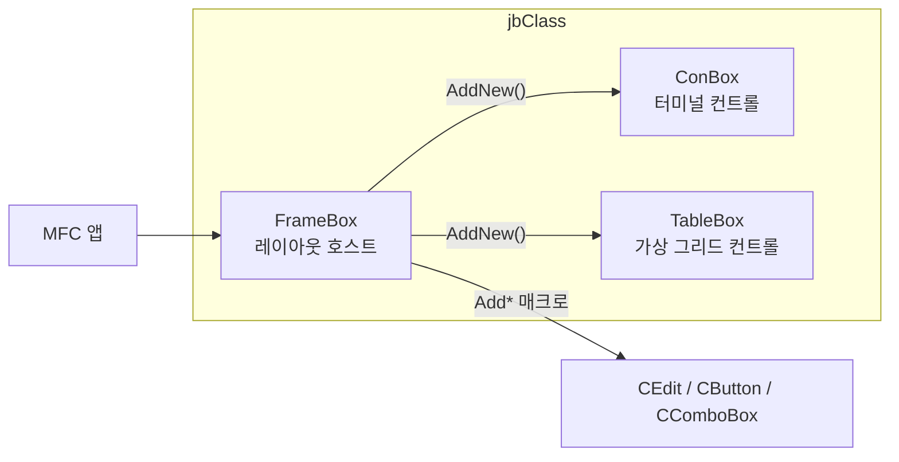
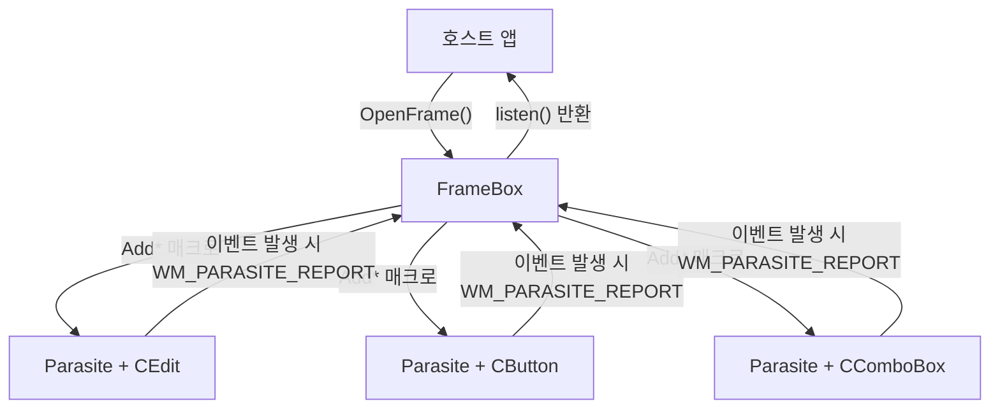
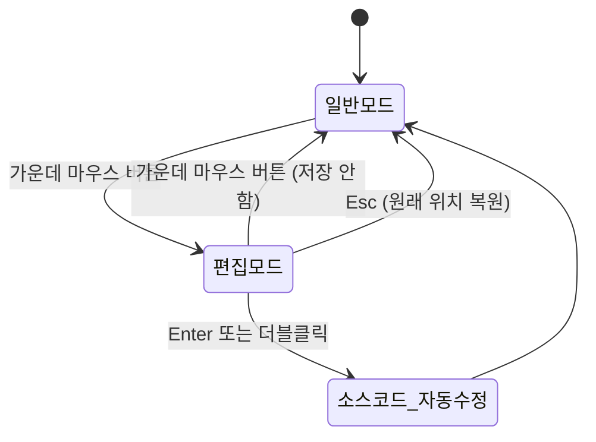
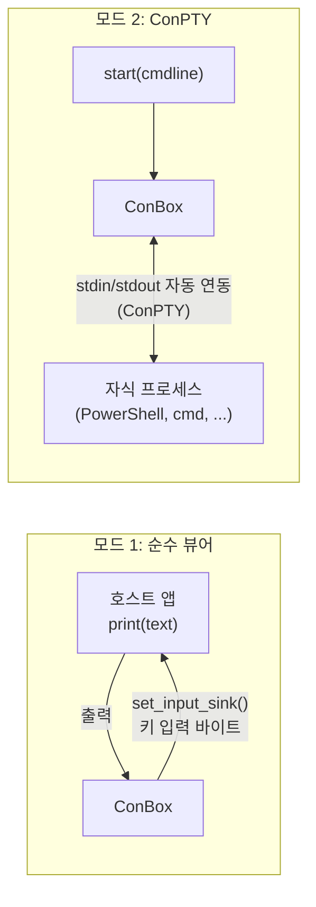
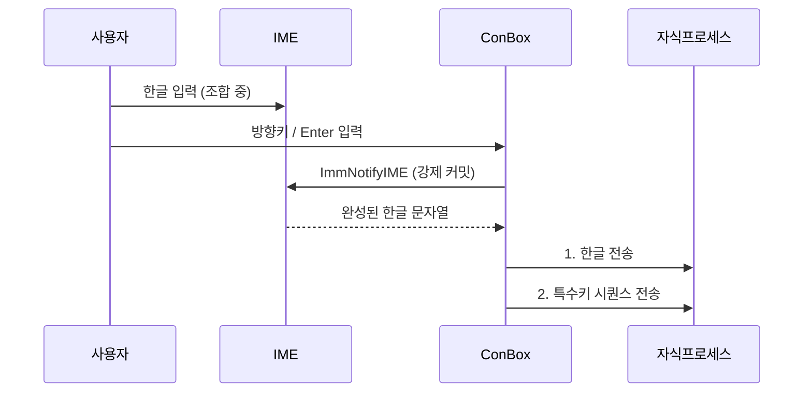
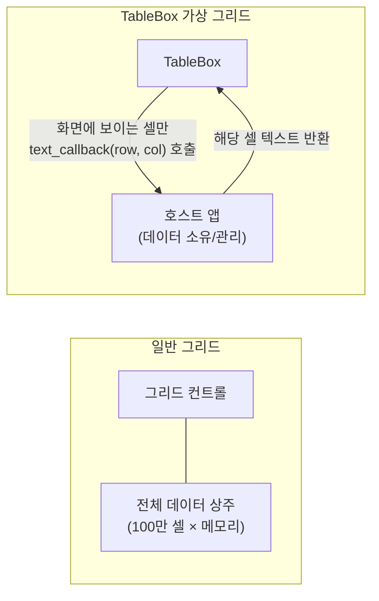
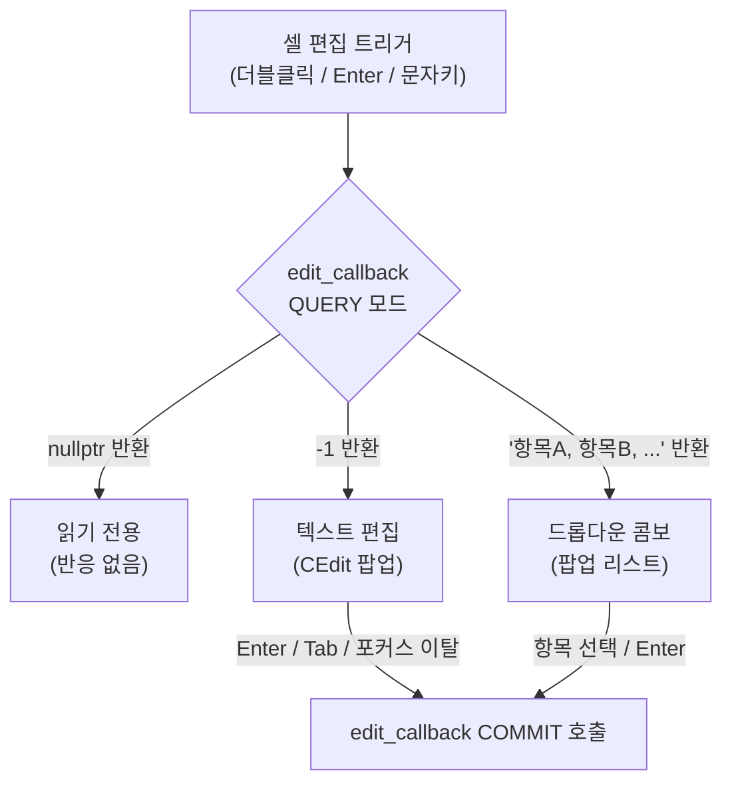
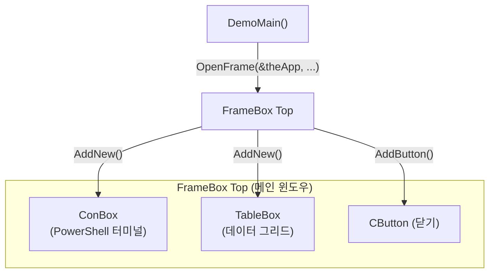

# jbClass 사용자 매뉴얼

## 목차

1. [라이브러리 개요](#1-라이브러리-개요)
2. [FrameBox - 레이아웃 호스트](#2-framebox---레이아웃-호스트)
3. [ConBox - 터미널 컨트롤](#3-conbox---터미널-컨트롤)
4. [TableBox - 가상 그리드 컨트롤](#4-tablebox---가상-그리드-컨트롤)
5. [통합 사용 예시](#5-통합-사용-예시)

---

## 1. 라이브러리 개요

jbClass는 MFC(Microsoft Foundation Classes) 기반 C++ 클래스 라이브러리로, 세 가지 독립 모듈로 구성됩니다.



| 모듈 | 역할 | 포팅 단위 |
|---|---|---|
| FrameBox | 컨트롤 레이아웃 호스트 + 런타임 편집기 | FrameBox.h + FrameBox.cpp |
| ConBox | VT100 터미널 컨트롤 (ConPTY 지원) | ConBox.h + ConBox.cpp |
| TableBox | 엑셀형 가상 그리드 컨트롤 | TableBox.h + TableBox.cpp |

### 공통 요구사항

- **OS**: Windows 10 1809 이상 (ConPTY 기능 사용 시 필수)
- **컴파일러**: Visual Studio 2022, Unicode 또는 MBCS 빌드 모두 지원
- **DPI 인식**: 앱 매니페스트에서 PerMonitorV2 DPI 인식 활성화 권장
- **좌표 단위**: 모든 API의 좌표/크기는 **96 DPI 논리 픽셀** 기준 (런타임에 실제 DPI로 자동 변환)

---

## 2. FrameBox - 레이아웃 호스트

### 2.1 개요

FrameBox는 MFC 컨트롤들을 동적으로 배치·관리하는 호스트 윈도우입니다. 두 가지 핵심 기능을 제공합니다.

1. **런타임 레이아웃 편집**: 실행 중에 컨트롤 위치/크기를 마우스로 조정하고 확인하면, 소스코드의 좌표 리터럴을 자동으로 수정합니다 (Debug 빌드 전용).
2. **절차지향 이벤트 처리**: `while` 루프 안에서 `listen()`을 호출하여, 어떤 컨트롤에서 이벤트가 발생했는지 순차적으로 처리합니다.

### 2.2 구조

FrameBox가 컨트롤을 생성하면, 각 컨트롤에 **Parasite**가 자동으로 부착됩니다. Parasite는 컨트롤을 서브클래싱하여 편집 기능과 이벤트 중계를 담당합니다.



### 2.3 기본 사용법

```cpp
#include "FrameBox.h"

void DemoMain() {
    // 1. FrameBox 생성 (스택 로컬 변수)
    FrameBox Top;
    Top.OpenFrame(&theApp, 560, 275, 1360, 875);  // 화면 좌표 (96 DPI 논리픽셀)

    // 2. 컨트롤 추가 (x0, y0, x1, y1 순서)
    CEdit*     e = Top.AddEdit  (10, 10, 200, 35);
    CButton*   b = Top.AddButton(10, 45, 100, 35, "확인");
    CComboBox* c = Top.AddCombo (10, 90, 200, 60, "항목A,항목B,항목C");

    // 3. 이벤트 루프
    while (::IsWindow(Top)) {
        CWnd* ev = Top.listen(e, b, c);    // 이벤트가 발생한 컨트롤 반환
        if (ev == 0 || ev == b) break;      // 닫기 또는 확인 버튼
    }
    // 스코프 종료 시 ~FrameBox()가 모든 컨트롤 자동 해제
}
```

> **[캡처]** 위 코드로 생성된 기본 FrameBox 창 (Edit, Button, ComboBox 배치)

### 2.4 컨트롤 추가 매크로

| 매크로 | 생성 컨트롤 | 추가 인수 |
|---|---|---|
| `AddEdit(x0,y0,x1,y1)` | `CEdit` | - |
| `AddButton(x0,y0,x1,y1, text)` | `CButton` | 버튼 텍스트 |
| `AddCombo(x0,y0,x1,y1, items)` | `CComboBox` | 쉼표 구분 항목 목록 |
| `AddStatic(x0,y0,x1,y1, text)` | `CStatic` | 레이블 텍스트 |
| `AddNew(x0,y0,x1,y1, wnd)` | 임의 `CWnd*` | `new`로 생성한 윈도우 (**소유권 이전**) |
| `AddAsItIs(x0,y0,x1,y1, wnd)` | 임의 `CWnd*` | 외부 소유 윈도우 (소유권 유지) |
| `AddZone(x0,y0,x1,y1)` | 자식 FrameBox (`WS_CHILD`) | - |
| `AddFrame(x0,y0,x1,y1)` | 자식 FrameBox (`WS_POPUP`) | - |

> 모든 좌표는 **96 DPI 논리 픽셀** 기준. 런타임 시 실제 모니터 DPI에 맞게 자동 스케일됩니다.

### 2.5 런타임 레이아웃 편집 (Debug 빌드 전용)

Parasite가 각 컨트롤에 부착되어 편집 기능을 제공합니다. **확인 시 `Add*` 매크로 호출부의 좌표 리터럴이 소스코드에서 직접 수정**됩니다.



**편집 모드 조작법**

| 조작 | 동작 |
|---|---|
| 가운데 마우스 버튼 | 편집 모드 토글 |
| 드래그 (컨트롤 안쪽) | 이동 |
| 드래그 (테두리 8px 이내) | 크기 조절 |
| 화살표 키 | 5px 이동 |
| Ctrl + 화살표 키 | 1px 이동 |
| Shift + 화살표 키 | 크기 조절 |
| Enter / 더블클릭 | 확인 → 소스코드 자동 수정 |
| Esc | 취소 (원래 위치 복원) |

> **[캡처]** 편집 모드 진입 후 컨트롤 테두리에 리사이즈 커서가 표시된 화면

> **[캡처]** 컨트롤을 드래그하여 이동하는 화면

> **[캡처]** Enter 확인 후 소스코드의 좌표 리터럴이 자동 수정된 결과 (에디터 화면)

### 2.6 Ctrl + 휠 줌

FrameBox는 `Ctrl + 마우스 휠`로 전체 레이아웃 줌을 지원합니다.

- **줌 범위**: 50% ~ 300% (기본값 100%)
- **커서 앵커**: 확대/축소 시 커서 아래 픽셀이 화면에 고정됩니다.
- **자식 전파**: ConBox, TableBox 등 자식 컨트롤에도 `WM_JBZOOM`으로 자동 전달됩니다.

> **[캡처]** 150% 줌 상태에서 FrameBox와 자식 컨트롤들이 확대된 화면

### 2.7 모달 서브 다이얼로그

`CWnd*`를 첫 인수로 지정하면, 부모 FrameBox를 자동으로 비활성화하는 모달 팝업이 생성됩니다.

```cpp
// Top이 열린 상태에서 모달 서브 다이얼로그 열기
FrameBox Sub;
Sub.OpenFrame(&Top, 200, 200, 600, 500);  // Top 자동 Disable
CButton* ok = Sub.AddButton(10, 10, 80, 30, "확인");
while (::IsWindow(Sub)) {
    CWnd* ev = Sub.listen(ok);
    if (!ev || ev == ok) break;
}
// Sub 스코프 종료 → Top 자동 재활성화
```

### 2.8 auto-fit (set_margin)

```cpp
Top.set_margin(10);  // 자식 컨트롤 최대 영역 + 10px 여백으로 FrameBox 크기 자동 조절
```

---

## 3. ConBox - 터미널 컨트롤

### 3.1 개요

ConBox는 MFC 창 안에 임베드 가능한 VT100 호환 터미널 컨트롤입니다. 두 가지 모드로 동작합니다.



### 3.2 기본 사용법

```cpp
#include "ConBox.h"

// 모드 1: 순수 뷰어
ConBox box;
box.set_efont("Consolas", 13, "B");    // 영문 폰트 (이름, 크기pt, 옵션)
box.set_kfont("Malgun Gothic", 0);     // 한글 폰트 (0 = 영문 폰트 높이에 맞춤)
box.open(parent, 0, 0);                // 생성 (크기는 행/열 설정에서 자동 계산)
box.print("\033[32mHello!\033[0m\n"); // VT100 이스케이프 시퀀스 사용 가능

// 모드 2: ConPTY (자식 프로세스 실행)
ConBox box;
box.open(parent, 0, 0);
box.start("powershell.exe");           // UTF-8 명령줄
```

> **[캡처]** ConPTY 모드에서 PowerShell이 실행된 화면

### 3.3 폰트 설정

ConBox는 영문 폰트(`set_efont`)와 한글 폰트(`set_kfont`)를 독립적으로 설정합니다.

```cpp
box.set_efont("Consolas", 13);            // 기본
box.set_efont("Consolas", 13, "B");       // Bold
box.set_efont("Consolas", 13, "I");       // Italic
box.set_efont("Consolas", 13, "BI");      // Bold Italic
box.set_kfont("Malgun Gothic", 0);        // 높이를 영문 폰트에 맞춤
box.set_kfont("Malgun Gothic", 13);       // 고정 크기 지정
```

- 한글(CJK) 문자는 셀 **2칸 너비**를 차지합니다.
- 한글 폰트 크기를 `0` 이하로 지정하면, 영문 폰트 픽셀 높이에 자동으로 맞춥니다.

> **[캡처]** 영문/한글 혼합 출력에서 폰트 높이가 맞춰진 화면

### 3.4 지원하는 VT100/ANSI 기능

| 카테고리 | 지원 내용 |
|---|---|
| C0 제어 | `\r`, `\n`, `\b`, `\t` (8칸 탭스톱) |
| 커서 이동 | CUU / CUD / CUF / CUB / CUP |
| 화면 지우기 | ED (전체), EL (줄), ECH (문자) |
| 스크롤 영역 | DECSTBM |
| 텍스트 속성 | SGR: Bold, Italic, Underline, Strikethrough, Blink, Reverse |
| 색상 | 기본 8색, 256색, True Color (24bit RGB) |
| 특수 | ESC 7/8 (DECSC/DECRC), RI, RIS |
| 2배 크기 | SGR 8: 2배 높이/너비 렌더링 |

> **[캡처]** 256색 / True Color 출력 테스트 화면 (색상 팔레트 표시)

> **[캡처]** Bold, Italic, Underline, Blink 등 SGR 속성 조합 화면

### 3.5 한글 IME 입력 처리

ConBox는 한글 IME 조합 중에 방향키나 Enter를 눌렀을 때 발생하는 순서 문제를 자동으로 처리합니다.



- **순서 보장**: 한글 커밋 → 특수키 전송 순서를 항상 유지합니다.
- **커서 위치 보정**: IME 커밋 후 자식 프로세스의 커서 위치를 자동 보정합니다.

> **[캡처]** PowerShell에서 한글 조합 중 방향키를 눌렀을 때 자연스럽게 처리되는 화면

### 3.6 마우스 조작

| 조작 | 동작 |
|---|---|
| 드래그 | 텍스트 선택 → 클립보드 자동 복사 |
| 더블클릭 | 단어 선택 |
| Alt + 드래그 | 직사각형 블록 선택 |
| 파일 드래그 앤 드롭 | 파일 경로를 stdin으로 전송 (경로에 공백 시 따옴표 자동 추가) |
| 마우스 휠 | 스크롤 |

> **[캡처]** 텍스트 드래그 선택 후 하이라이트 표시된 화면

> **[캡처]** 오버레이 스크롤바가 나타난 화면 (페이드아웃 전)

### 3.7 저장 및 로그

```cpp
box.save_emf("C:/output/");       // EMF 벡터 파일로 페이지별 저장
box.save_pdf("C:/output.pdf");    // PDF 저장 (시스템 PDF 드라이버 사용)
box.save_log("C:/log.bin");       // 자식 프로세스 원시 바이트스트림 저장
auto lines = box.get_text_lines(); // 스크롤백 포함 텍스트 줄 목록 반환
```

---

## 4. TableBox - 가상 그리드 컨트롤

### 4.1 개요

TableBox는 엑셀과 유사한 인터페이스의 가상 그리드 컨트롤입니다.

**가상 그리드 방식이란?**



화면에 보이는 셀만 실시간으로 요청하므로, 수백만 행의 데이터도 메모리 부담 없이 표시할 수 있습니다.

### 4.2 기본 사용법

```cpp
#include "TableBox.h"

// 텍스트 콜백: 모든 셀의 표시 내용 반환 (호스트가 구현)
const char* MyText(int row, int col, void* user) {
    static char buf[64];
    if (row == 0) { /* 헤더 행 */ }
    sprintf_s(buf, "(%d,%d)", row, col);
    return buf;
}

// 편집 콜백: 셀 타입 반환(QUERY) + 편집 완료 처리(COMMIT) - 선택 사항
const char* MyEdit(int row, int col, const char* text, void* user) {
    if (text == nullptr) {
        // QUERY 모드: 셀 타입 반환
        if (row == 0) return nullptr;                   // 헤더: 읽기 전용
        if (col == 2) return "항목A, 항목B, 항목C";     // 콤보 셀
        return (const char*)(-1);                        // 텍스트 편집 가능
    }
    // COMMIT 모드: 편집 완료 (text = 새 값 또는 선택 인덱스 문자열)
    return nullptr;
}

// TableBox 생성 순서: set_* → open()
TableBox* table = new TableBox;
table->set_cols(100, 15);                       // 열 너비 100px, 총 15열
table->set_rows(25, 1000);                      // 행 높이 25px, 총 1000행
table->set_fixed(1, 1);                          // 헤더 1행 1열 고정
table->set_text_callback(MyText, nullptr);
table->set_edit_callback(MyEdit, nullptr);       // 생략 시 읽기 전용 그리드
table->set_font("Malgun Gothic", 10);
table->set_align(4);                             // 텍스트 중간-왼쪽 정렬
table->open(parent, x0, y0, 20, 10);            // 최초 표시: 20행 × 10열 크기
```

> **[캡처]** 기본 TableBox 그리드 화면 (헤더 고정, 스크롤 가능)

### 4.3 셀 타입

`set_edit_callback`의 QUERY 반환값으로 셀 타입을 결정합니다.



> **[캡처]** 텍스트 셀 편집 중인 화면 (셀 위에 CEdit 팝업이 열린 상태)

> **[캡처]** 콤보 셀 드롭다운 팝업이 열린 화면

### 4.4 키보드 탐색 및 편집

| 키 | 동작 |
|---|---|
| 화살표 키 | 포커스 셀 이동 |
| PageUp / PageDown | 한 화면 단위 세로 스크롤 |
| Home / End | 행의 첫/마지막 열 |
| Ctrl + Home / Ctrl + End | 전체 그리드 첫/마지막 셀 |
| Shift + 화살표 | 셀 범위 선택 확장 |
| Enter | 편집 시작 (또는 커밋 후 아래로 이동) |
| Tab | 편집 커밋 후 오른쪽으로 이동 |
| Esc | 편집 취소 |
| 문자 키 | 텍스트 셀 즉시 편집 시작 (입력 내용으로 덮어쓰기) |

### 4.5 마우스 조작

| 조작 | 동작 |
|---|---|
| 셀 클릭 | 포커스 이동 |
| 셀 더블클릭 | 편집 시작 |
| 콤보 셀 화살표 클릭 | 드롭다운 즉시 열기 |
| 드래그 | 셀 범위 선택 |
| 열 헤더 클릭 | 해당 열 전체 선택 |
| 행 헤더 클릭 | 해당 행 전체 선택 |
| 좌상단 코너 클릭 | 전체 그리드 선택 |
| 헤더 경계선 드래그 | 열/행 크기 조절 |
| 헤더 경계선 더블클릭 | 열/행 너비 자동 맞춤 (Auto-fit) |

> **[캡처]** 여러 셀이 선택된 상태 (파란 하이라이트, 열/행 헤더 강조 표시)

> **[캡처]** 열 헤더 경계선을 드래그하여 열 너비를 조절하는 화면

> **[캡처]** 세로/가로 오버레이 스크롤바가 표시된 화면

### 4.6 열/행 크기 조절

크기 조절은 **벡터 형식**(`set_cols(vector)`)으로 설정한 열/행에만 동작합니다.

```cpp
// 벡터 형식: 크기 조절 가능
table->set_cols({120, 80, 150, 100, 200});    // 5열, 각 너비 지정
table->set_rows({30, 25, 25, 25, 25});        // 5행, 각 높이 지정

// 균등 형식: 크기 조절 불가
table->set_cols(100, 15);                      // 전열 동일 너비
```

**선택 인식 크기 조절**: 선택 범위에 속한 헤더 경계선을 드래그하면 해당 범위 내 **모든** 열/행에 동일하게 적용됩니다 (Excel과 동일한 동작).

### 4.7 커스텀 셀 렌더링

`draw_cell`을 오버라이드하여 셀 렌더링을 완전히 제어할 수 있습니다.

```cpp
class MyGrid : public TableBox {
protected:
    void draw_cell(CDC& dc, int row, int col, int x0, int y0, int x1, int y1) override {
        // 짝수 행 배경색 변경
        if (row % 2 == 0) {
            dc.FillSolidRect(x0, y0, x1 - x0, y1 - y0, RGB(245, 245, 255));
            const char* txt = cell_text(row, col);  // 텍스트만 가져오기
            // ... DrawTextW로 직접 렌더링
        } else {
            TableBox::draw_cell(dc, row, col, x0, y0, x1, y1);  // 기본 렌더링 위임
        }
    }
};
```

> **[캡처]** 짝수/홀수 행 배경색을 다르게 커스텀 렌더링한 화면

---

## 5. 통합 사용 예시

FrameBox 안에 ConBox와 TableBox를 함께 배치하는 예시입니다.



```cpp
#include "FrameBox.h"
#include "ConBox.h"
#include "TableBox.h"

void DemoMain() {
    FrameBox Top;
    Top.OpenFrame(&theApp, 100, 100, 1400, 900);

    // 왼쪽: ConBox 터미널
    ConBox* con = new ConBox;
    con->set_efont("Consolas", 12);
    con->set_kfont("Malgun Gothic", 0);
    con->open(&Top, 0, 0);
    con->start("powershell.exe");
    Top.AddNew(10, 10, 690, 860, con);    // 소유권 FrameBox로 이전

    // 오른쪽: TableBox 그리드
    TableBox* table = new TableBox;
    table->set_cols(100, 8);
    table->set_rows(25, 500);
    table->set_fixed(1, 1);
    table->set_text_callback(MyText, nullptr);
    table->set_font("Malgun Gothic", 9);
    table->open(&Top, 0, 0);
    Top.AddNew(710, 10, 1380, 820, table);

    // 닫기 버튼
    CButton* btnClose = Top.AddButton(710, 830, 800, 860, "닫기");

    // 이벤트 루프
    while (::IsWindow(Top)) {
        CWnd* ev = Top.listen(btnClose);
        if (!ev || ev == btnClose) break;
    }
}
```

> **[캡처]** 왼쪽 ConBox(PowerShell), 오른쪽 TableBox가 배치된 통합 화면

> **[캡처]** Ctrl+휠 줌 시 ConBox, TableBox, 버튼이 모두 함께 확대된 화면

---

*jbClass - MFC 기반 컨트롤 라이브러리 / 개발 중*
